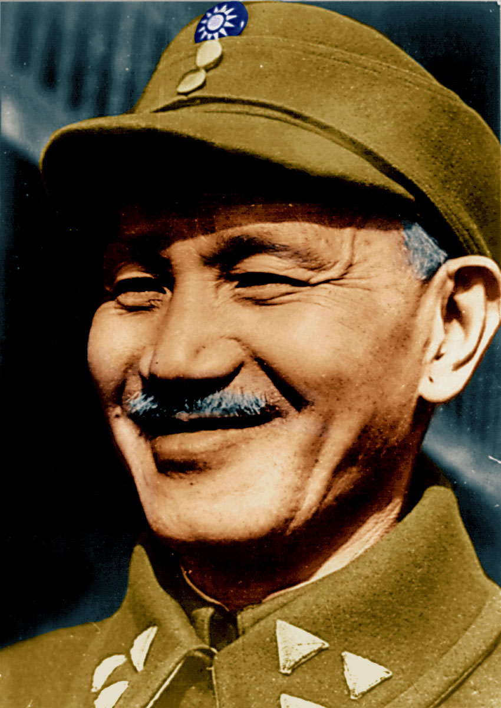

# A View From Yushan

> Swirling ocean, beautiful islands;  
> A transcultural republic of citizens.[^TROC]

---

[^TROC]: This is an alternate interpretation of 中華民國 (lit. "amidst" "cultures" "citizens" "nation"), usually translated as "Republic of China".

Standing at the summit of East Asia's highest peak, [Yushan](https://en.wikipedia.org/wiki/Yu_Shan) (Jade Mountain), one can not only look down on Taiwan, but also feel how this small, mountainous island nation is a global crossroad. Located at the junction of the Eurasian and Pacific tectonic plates, Taiwan's geological fault line yearly pushes it up, even as it also regularly causes earthquakes against which rigorous building code protect inhabitants. In the same way, the clash of Taiwan's diverse culture, history and values has built a prosperous and innovative society, while pro-social digital innovation has managed to protect it from polarization.

Today, with a voter turnout rate over 70%[^twelectionv], second-highest religious diversity in the world[^ReligiousDiversityIndex], and 90% of global supply capacity for advanced chips, Taiwan has broken through geographic constraints and demonstrated the resilience of a democratic society to collaborate with its region and the world.

[^twelectionv]: “Billing Profile Information,” Central Election Commission, n.d, https://db.cec.gov.tw/ElecTable/Election?type=President.
[^ReligiousDiversityIndex]: Joseph Liu, “Global Religious Diversity,” _Pew Research Center_, April 4, 2014. https://www.pewresearch.org/religion/2014/04/04/global-religious-diversity/.

Taiwan's ability to achieve among the world's lowest fatality rates without any lockdowns during the Covid crisis — while maintaining among the fastest economic growth rates in the world — show the results of the plural spirit of Taiwan's information society. Whether it's a map of masks or a social safety distance, these are all manifestations of technologies for collaborative diversity, deeply rooted in daily life.[^ExcessDeaths]

[^ExcessDeaths]: “Tracking Covid-19 Excess Deaths across Countries,” The Economist, October 20, 2021. https://www.economist.com/graphic-detail/coronavirus-excess-deaths-tracker.

### Place of convergence

One etymology of Taiwan's name is from the indigenous word "Taivoan", meaning "place of convergence". Taiwan has arguably been a launching point for long-distance cooperation longer than anywhere on earth, [being believed](https://historylearning.com/history-of-the-philippines/pre-history/population-theories/out-of-taiwan-model/) to be the starting point for the journeys of thousands of miles by Polynesian voyagers in the second millennium BCE.[^Bellwood] The story of this island and its people, influenced by indigenous cultures, colonial powers, and political ideologies from the region and world, centers on the ongoing conflict and co-creation between different notions of what this place is and what it can be. This raucous and rich clash has poured out a unique form of democracy forged by a history of constant upheaval.

[^Bellwood]: Peter Bellwood, _Man's Conquest of the Pacific: the Prehistory of Southeast Asia and Oceania_ (Oxford, UK: Oxford University Press, 1979).

Two dramatic personal experiences of the lead authors of this book illustrate this unique cultural and political setting. On March 18, 2014, a group of students frustrated by the substance and process of a new trade deal with Beijing and inspired by the global "Occupy" movement climbed over the fence surrounding the legislature building. A similar occupation of the American legislative Capitol almost seven years later lasted only a few hours and yet is one of the most divisive events in American history. In contrast, the "Sunflower" (318) occupation lasted more than a hundred times as long (more than 3 weeks) and yet the demands of the protesters were eventually largely accepted as a consensus; the movement led to a change of government and the rise of new political parties.

Perhaps most importantly, the movement led to a deeper and more lasting shift in politics, as the government at the time gained respect for the movement and ministers invited younger "reverse mentors" to help them learn from youth and civil society. One particularly proactive such minister, one of the world's first ministers in charge of digital participation, Jaclyn Tsai recruited one of us to begin our journey of public service. Eventually this led to her taking that role in 2016 and in 2022 becoming the first Minister of Digital Affairs.

Almost a decade after these events, the other primary author of this book visited to witness the general election held January 13, 2024, which launched a "year of elections" in which more people than in any previous year will vote and followed hot on the heels of the "year of AI", when generative models like GPT burst into the public consciousness. Many expect these models to turbocharge information manipulation and interference by authoritarian actors. This election seemed a test case, with a more concerted, better-funded adversary focused on a small population than anywhere in the world.[^VDemInfo] Walking the streets of Taipei on the eve of that election, he saw no shortage of divisions for such attacks to exploit. At the rally of the ruling Democratic Progressive Party (DPP) he found not a single official flag, only placards of the island, the party's signature green color and occasional rainbow flags 🏳️‍🌈. At the rally of the opposition Kuomintang (KMT or Nationalist) party, he saw only the flag of the Republic of China (ROC) 🇹🇼. It made him imagine how much more extreme the divisions of his American home would be if Democrats waved a historical British flag and Republicans the stars and stripes.

FIX FLAG DIAGRAM

[^VDemInfo]: “Disinformation in Taiwan: International versus Domestic Perpetrators,” V-Dem, 2020. https://v-dem.net/weekly_graph/disinformation-in-taiwan-international-versus

Yet, despite these extreme divides and harnessing the technologies developed partly as a result of the Sunflower movement, the January 13 election has become a positive model to the world, with the candidate of the party opposed by the authoritarian adversary outperforming opinion polls, calm prevailing after the election and a largely consensual outcome being reached across the society. This capacity to harness technology and social organization to channel widely divergent attitudes towards shared progress was most sharply manifested in the decade of work following the Sunflower movement. Yet it has far deeper historical roots, roots that come from different starting points and converge on this fateful decade of digital democracy.

### Taiwan's historical lineage

The divergent identities emphasized by the DPP and KMT correspond to different facets and imaginations of what "this place is." These resonate with an alternate etymology for the island's name: "tayw"-"an", which means "people"-"place" in another, closed-related indigenous language (Siraya). For the KMT (identified with the color blue), Taiwan is defined by most of its people speaking Chinese languages such as Mandarin, Taigi (Taiwanese Hokkien) and Hakka. Some would go as far as to argue that Taiwan is more ethno-historically "Chinese" than the PRC, with more than 80% speaking Mandarin as a primary language (compared to 70% in PRC), more than 40% following traditional religions such as Daoism (compared to less than 20% in PRC) and the official government ideology being Tridemism (more below) rather than imported Marxism. In contrast, for those influenced by the DPP (identified with "green") view, Taiwan is a place, and island whose history is diverse and transcultural, spent only two centuries as a periphery under Qing Chinese rule and should be the center of determining its own future. To make sense of these divides, we must therefore trace briefly both the history of this island and of the ROC government.

The island's history is replete with war, rebellion, colonizers, and national independence narratives at every turn. Like many islands in the South China Sea, indigenous peoples in Taiwan encountered larger imperial powers, such as the Spanish, the Japanese, and the Dutch, through colonial expansion. By the seventeenth century, the Dutch settled in the southern part of the island while the Spanish settled in the northern region; both of these settlements were ports intended for trade, while much of the island remained inaccessible due to terrain and indigenous peoples violently opposing colonial control.[^JJ1]

[^JJ1]: Emma Teng, _Taiwan's Imagined Geography: Chinese Colonial Travel Writing and Pictures, 1683-1895_, (Cambridge, Mass.: Harvard University Asia Center, 2004), 33.

South China Sea merchants (or pirates, depending on how you encountered them), all hailing from Japan, China, and Southeast Asia, also settled on the island or used the ports. In 1662, Zheng Chenggong, or Koxinga, in open rebellion against the newly established Qing dynasty (1644-1911), forcibly removed the Dutch from their seat of power in the southern region and continued his campaign against the Qing from Taiwan.[^JJ2] By 1683, the Zheng family-led rebellion was defeated, and Taiwan came nominally under the control of the Qing.

[^JJ2]: Emma Teng, _Taiwan's Imagined Geography: Chinese Colonial Travel Writing and Pictures, 1683-1895_, (Cambridge, Mass.: Harvard University Asia Center, 2004), 33, 1-2.

Little more than two hundred years later, in 1895, Qing dynasty's defeat in the Sino-Japanese war set in motion two sequences of events that would define the modern history of Taiwan. First, Qing ceded Taiwan and its immediately surrounding islands to Japan, marking the beginning of a half-century of Japanese colonial rule in Taiwan. Second, this defeat fueled the rise of a nationalist movement that created the ROC.[^NationalismRoots] We must follow each of these strands as they diverge.

[^NationalismRoots]: Suisheng Zhao, _The Dragon Roars Back: Transformational Leaders and Dynamics of Chinese Foreign Policy_, (Stanford, California: Stanford University Press, 2022), 132.

In Taiwan, Japanese occupation marked the beginning of the democracy movement. Governor Tang Jingsong took advantage of the change in leadership to establish a short-lived independent Formosa Republic, which was in turn suppressed at the cost of 12,000 lives in a 36,000-square-kilometer island. During Japanese colonial rule, the policy of "dōka" (assimilation) once again attempted to incorporate the Taiwanese into the Japanese cultural and linguistic system. The policy in the Japanese Empire acted to thoroughly integrate language, governmental structure, urban construction, and the education of Taiwan's elite and intelligentsia with Japan's, including bringing many to Japan for education.

Despite the enormous efforts and funds invested by the Japanese empire, Taiwan's resistance and identity remained. Different ethnic groups were considered more or less "civilized"; the less civilized a group of people was, the harsher and more violent the Japanese government was, thus creating fundamentally different experiences for indigenous, Taigi and Hakka people under Japanese control.[^JJ10] The rise of the global anti-colonial movement and the Taishō democratic reforms within Japan at the beginning of the 20th century provided intellectuals and activists in Taiwan with the ideological foundation for self-determination. Local elections in held in 1935 that included a small fraction of property-owning men as electors provided a first taste of democratic participation at least to Taiwanese elites, encouraging the pursuit of greater autonomy and expression.[^JJ11]

[^JJ10]: Jeffrey Jacobs, _Democratizing Taiwan_, (Boston: Brill, 2012), 22.
[^JJ11]: Ashley Esarey, “Overview: Democratization and Nation Building in Taiwan” in _Taiwan in Dynamic Transition: Nation Building and Democratization_, edited by Thomas Gold, (Seattle: University of Washington Press, 2020), 24

### Tridemism

Across the Taiwan strait, a young, American-educated, Christian doctor and activist, Sun Yat-Sen, was similarly influenced in a revolutionary democratic direction by Qing's defeat at Japan's hands, but for a very different reason. Concluding that the dynasty was unreformable, Sun and his "Revive China Society" led a series of unsuccessful uprisings that forced him into exile in Japan, where he (like the Taiwanese elites sent to Japan to be educated) absorbed nascent democratic reform. Drawing on these Japanese, Christian and American influences as well as Confucian traditions, Sun articulated his _[Three Principles of the People](<https://en.wikipedia.org/wiki/Three_Principles_of_the_People#:~:text=The%20three%20principles%20are%20often,the%20people%20(or%20welfarism).>)_ in 1905, laying the foundation of the "Tridemism" that would become the official philosophy (and national anthem) of the ROC.

<figure>
  
  <figcaption>Original flag of the ROC (1912-1928)</figcaption>
</figure>
  

The first principle is 民族/Minzú (literally "civil clan"), which is typically translated as "nationalism". However, perhaps more notable was its emphasis on ethnic pluralism (五族共和) reflected in the original flag of the ROC[^ROC1912Flag], which included colors for each of the major ethnicities at the time. The second is 民權/Minquán (literally "civil rights"), usually translated as "democracy" and articulated as a combination of rights of election, recall, initiative and referendum and division of powers among five "Yuans" (the Legislative, Executive and Judicial of the European tradition plus the Control and Examination divisions of the Confucian tradition). The third is 民生/Mínshēng (literally "civil livelihood"), usually translated as "socialism", draws from a variety of economic philosophies, including the ideas of Henry George, an American political economist known for his advocacy of land rights equality, anti-monopoly stances, and support for cooperative enterprises. We will discuss these ideas much more extensively in the next part of the book.

[^ROC1912Flag]: "Flag of China (1912–1928)," n.d. Wikimedia Commons, https://commons.wikimedia.org/wiki/File:Flag_of_China_(1912%E2%80%931928).svg.

Harnessing these ideas, Sun built international support from foreign allies and expatriates around the world that eventually allowed him and his allies to overthrow the Qing in 1911 and found the ROC in 1912. Despite this initial success, internal conflict quickly forced him again into exile and then back to take part in a civil war. In 1919, he managed to marshal his forces and found the modern KMT.

That year he also met another crucial influence on the ideas of the ROC, a disciple of Henry George who was visiting China partly to see how George's ideas might play out on a social scale. John Dewey was perhaps the most respected American philosopher and among the most respected educators and philosophers of democracy globally. Dewey's "pragmatic" theory of democracy (translated by his Chinese student Hu Shih as "experimentalism"), which we will discuss in greater detail in the next part of this book, resonated with the uncertain and exploratory atmosphere of early ROC.

On the one hand, this fluid, experimental and emergent approach shared much with Taoist traditions popular among democratic opponents of Qing and warlord monarchy.[^TaoDewey] On the other hand, unlike many more imperialistic foreign observers, Dewey advocated the ROC following its own path of "collaborative problem solving" as the axis of modern experimental model schools. This led Dewey to become something of a bridge between the ROC and the West, especially the US, giving over 200 lectures in China while writing monthly columns on his experiences for emerging outlets such as _The New Republic_. In the process, he helped forge a deep and enduring connection between the ROC and the US.

[^TaoDewey]: Richard Shusterman, “Pragmatism and East‐Asian Thought,” _Metaphilosophy_ 35, no. 1-2 (2004): 13, https://www.academia.edu/3125320/_Pragmatism_and_East_Asian_Thought_.

The roughly concurrent success of the Russian revolution brought financial support and military training to the previously marginal Chinese Communist Party (CCP). While inspired by a different, Marxist vision of socialism, Sun allied with the communists to unify the country. This effort, nearly successful at the time of his death in 1925, has made Sun the "Father of the Nation" for the Nationalists and the "Forerunner of the Revolution" for the Communists.

That moment of unity was, however, short-lived, with the communists (under Mao Zedong) and nationalists (under Chiang Kai-shek) alternatingly engaging in civil war and alliances against warlords and Japanese occupiers during the next twenty years, until the final defeat of the Japanese in 1945. Focused overwhelmingly on both the struggle for national liberation and against each other, neither the Communists nor the Nationalists thought much of Taiwan.[^MaoTaiwan]

[^MaoTaiwan]: Yet, to the extent they did address it, Mao supported Taiwan as an independent communist state much as he hoped for Korea and Vietnam, while Chiang (almost as an afterthought) requested the return of Taiwan after the war along with other territories formerly occupied by Japan, including Manchuria.

### Postbellum Taiwan

At the conclusion of the war, Chiang was nominally "Chairman of the National Government of China" and thus received Taiwan from the allies upon Japanese defeat.
<figure>
  
  <figcaption>Chiang Kai-Shek</figcaption>
</figure>
This change was initially welcomed by the people of Taiwan, who had been inspired by the democratic ideals of Sun.[^JJ13] This excitement quickly soured, however: while the intellectual discussion of democracy flourished in newspapers and periodicals, the reality under the ROC was anything but. The end of the WWII brought an immediate renewal of civil war, during which a corruption-riddled ROC government increasingly took its fury at its increasing defeat out on the one subject population it securely control on Taiwan, culminating in the incident of February 28, 1947; tens of thousands were killed in the aftermath.[^JJ14]

[^JJ13]: Louzon Victor. “From Japanese Soldiers to Chinese Rebels: Colonial Hegemony, War Experience, and Spontaneous Remobilization during the 1947 Taiwanese Rebellion,” _The Journal of Asian Studies_ 77, no. 1 (2018): 168.
[^JJ14]: Chien-Jung Hsu, _The Construction of National Identity in Taiwan’s Media, 1896-2012_, (Leiden: Brill, 2014), 48.

In 1949, having been defeated by Communists, Chiang and two million ROC soldiers and civilians relocated to Taiwan, declaring it the home of "free China", while simultaneously imposing martial law on the eight million native, primarily Taigi- and Hakka-speaking population that came to be known as the "White Terror". Acting as dictator, Chiang positioned the ROC to the world as the true representatives of China. Internally, people in Taiwan experienced a violent outsider government, one that had swiftly taken control of the island and began to suppress any sign of Taiwanese identity systematically and ruthlessly.[^JJ15]

[^JJ15]: Chien-Jung Hsu, _The Construction of National Identity in Taiwan’s Media, 1896-2012_, (Leiden: Brill, 2014), 71.

At the same time, the government whose official ideology was Tridemism began sowing many seeds of social reform that would eventually sprout into democratic movements in Taiwan. Given his lack of ties to the island and its local elites, Chiang was able to impose the Rural Land Reform, including a rent reduction to 37.5% in 1949, the release of public land in 1951 and the breaking up of large estates in the 1953 policy of "land to the tiller". This was extended to impose a Georgist land value tax in 1977, the details of which we will describe later. Together, as many scholars have argued, these reforms laid an egalitarian economic foundation that proved critical to Taiwan's later social and economic development.[^AsiaWorks]

[^AsiaWorks]: Joe Studwell, "How Asia Works: Success and Failure in the World’s Most Dynamic Region," (London: Profile, 2013).

Another outgrowth of Tridemism was a focus on cooperative enterprise, enshrined in Articles 145 of the ROC Constitution, which states that "private wealth and privately-operated enterprises, the State shall restrict them by law if they are deemed detrimental to a balanced development... Cooperative enterprises... and foreign trade shall receive encouragement." While influenced by Georgist ideas, this support for industrial cooperatives and participative production also drew heavily on traditions of agricultural and industrial cooperation developed during the Japanese colonial rule, further influenced by American thinkers like Edward Deming who emphasized the empowerment of line workers in improving production under the US occupation of Japan that he worked for.[^EdwardDeming]

Together these influences fostered the development of a robust civil and cooperative sector in Taiwan (which we collectively call the Third Sector), critical to its industrial and political future. Furthermore, the constitutional and historical focus on trade, as well as public investment in export-supporting infrastructure, propelled Taiwan's rise. By the 1970s, Taiwan became a major supplier of components for advanced Western technologies.

Taiwan's education system was similarly influenced by the intellectual ferment of the early ROC period, with Dewey's student Hu fleeing to Taiwan alongside the KMT that he sometimes feuded with. As President of the national research institute Academia Sinica and a leading intellectual, Hu became a central influence on the development of Taiwan's educational system. His fusion of Confucian traditions with Deweyian pragmatism, egalitarianism and democracy helped shape Taiwanese education into the envy of the world, topping world league tables on a range of benchmarks.[^TaiwanEd]

[^TaiwanEd]: “John Dewey and Free China,” Taiwan Today, January 1, 2003, https://taiwantoday.tw/news.php?unit=12.

### Coming of democracy

The 1960s, parallel to the American Civil Rights movement, saw an outburst of demands against the KMT and Chiang Kai-Shek for Taiwan’s independence and a truly democratic government. Taiwan-born National Taiwan University Professor Peng Ming-min (1921-2022) and two of his students, Hsieh Tsung-min and Wei Ting-chao, circulated the Taiwan Self-Salvation Manifesto, which called for a freed and independent Taiwan, decrying the ROC as an illegitimate government.[^JJ18] Though this moment ended with Peng's exile, the manifesto sparked a national conversation that further spurred democratic advocates to demand access to national elections.

[^JJ18]: Ryan Dunch, and Ashley Esarey, _Taiwan in Dynamic Transition: Nation-Building and Democratization_, (Seattle: University Of Washington Press, 2020), 28.

The United Nations was central to the ROC's early identity under the White Terror as it was not only one of the founding members of the UN, but also the only Asian permanent member of the Security Council. This prominent international role was the leading irritant to the People's Republic of China (PRC) regime, preventing it from participating in international affairs and leading the CCP to change its position from initially supporting Taiwanese independence to an ideological focus on conquering Taiwan. However, as the US sought to contain its failures in Vietnam, President Richard Nixon secretly pursued accommodation with the PRC, including supporting an Albanian-sponsored Resolution 2758 by the General Assembly on October 25, 1971 that transferred recognition of "China" from the ROC to the PRC, finally culminating in Nixon's visit to PRC in 1972. As a result, the ROC "withdrew" from the UN, transforming its identity and international standing.

On the one hand, this withdrawal internationally greatly limited the scope of Taiwan's international activities and its ability to engage in economic and trade activities. It also led the US and much of the non-Communist world to shift from a position of unconditional alliance with the ROC to one of careful balancing of interests and ambiguity, seeking to prevent PRC's violence over Taiwan while also supporting a policy of acknowledging its "One China" position.

Internally, this change in identity undermined much of the rationale for the White Terror, as the prospect of global support for a war to suppress the "Communist rebellion" withered, and undermined the aspirational identity of "free China". The contradictions between the increasingly egalitarian, Third Sector-driven and highly progressively educated population, on the one hand, and an authoritarian repressive state on the other thus became increasingly overwhelming, especially with the development of labor unions and political civic associations and the death of Chiang all before the end of the 1970s. The lives of the parents of one of the authors of this book are a perfect illustration of these trends: as pioneers of community college and consumer cooperative movements, they benefited from the cooperative support in the ROC constitution. Yet, as journalists, they covered and helped support those repressed by the state, such as in the Kaohsiung Incident of 1979 when leaders of the political opposition were imprisoned, building the foundation for democratization.

Taiwan's weakened international position also allowed dissidents exiled during the White Terror to put increasing pressure on Chiang's son and successor Chiang Ching-Kuo. The liberalization of Taiwan under the younger Chiang in the 1980s created an environment where democratic action, protests, essays, songs, and art reflected the growing belief for general elections. Those who called for democracy were still in exile or jailed, but their relatives and friends began to run for local and national political offices.[^JJ22]

[^JJ22]: Ryan Dunch, and Ashley Esarey, _Taiwan in Dynamic Transition: Nation-Building and Democratization_, (Seattle: University Of Washington Press, 2020), 31.

### Vibrant democratic generation

In 1984, Chiang Ching-Kuo selected Lee Teng-hui (1923-2020) as the first Taiwan-born vice president. This choice signaled a change in the political landscape of Taiwan.[^JJ23] When Lee became President in 1988, he quickly instituted a range of democratic reforms, calling for the direct election of the President and vesting the sovereignty of the country in the "citizens of the Free Area" of the ROC (those living on the Taiwan islands). This led him to become the first directly elected President in 1996, just a few months after the Bill Gates's "Internet Tidal Wave" memo heralded the mainstream arrival of the internet age.

[^JJ23]: Jeffrey Jacobs, _Democratizing Taiwan_, (Boston: Brill, 2012), 62.

Already among the most technology-intensive export economies in the world, this tidal wave swept the Taiwanese economy and society with the same force as democratization. Thus the internet and democracy were something of Siamese twins in Taiwan. Four years later, the first DPP President, Chen Shui-bian, narrowly won election as the Blue camp splintered. With the return of the KMT to the Presidency eight years later in 2008, a system of alternation between the Blue vision of "free China" and the Green vision of "island nation" was established as the pattern of politics.

Yet despite this deep and persistent division that fueled the Sunflower movement, the overlapping consensus between these perspectives is striking:

1. Pluralism: Both the Blue and Green stories share a strong emphasis on pluralism. For Blue, it's about fusing both contemporary and traditional culture (exemplified by the National Palace Museum) and the Tridemist tradition of pluralism, while highlighting ROC's role as a cultural inheritor and leader; while the Greens focus on the diversity of those who have settled in Taiwan, including the indigenous peoples, Japanese, Hokkien, Hakka, Westerners, and new immigrants.
2. Diplomatic nuance: To navigate the challenging relationship with the PRC, both have had to embrace a range of complex and nuanced public positions around the security posture of the US and other allies, the meaning of ROC and Taiwan, as well as the concept of "independence".
3. Democratic freedom: The ideas of "democracy" and "freedom" are core to both ideologies. For Greens, these ideas are the core of Taiwan's rallying cries overcoming both the White Terror and PRC authoritarianism. To Blues, these ideas are core to Tridemism and thus, in their eyes, qualities that a ROC leadership must focus on.
4. Anti-authoritarianism: Both are deeply concerned about growing authoritarianism in the PRC, especially in the last decade with the failure of the "One Country, Two Systems" formula in Hong Kong.
5. Export-orientation: Both parties celebrate success as a commercial exporter and also see the ability to export ideas and culture as central to the future. For Blues this focuses more on influencing the PRC to be more like Taiwan, while for Greens it focuses on gaining respect in the "free world" that Taiwan needs to defend itself.

In addition to this ideological overlap, the two sides have both benefited from and been immersed in the central role the island has come to play in the global electronics industry. As the center of the semiconductor and smartphone supply chain, while also having the fastest internet in the world[^Statista], no country is more thoroughly immersed in the digital world than Taiwan.

[^Statista]: Taiwan News, “Taiwan Has No. 1 Fastest Internet in World,” October 23, 2023. https://www.taiwannews.com.tw/en/news/5025449.

This combination of an overlapping consensus on plural, complex, free, world-facing democracy, where digital tools are easily available to help navigate the resulting ambiguity, has allowed Taiwan to become, in the last decade, the world's leading example of digital democracy.

[^EdwardDeming]: After World War II, Japan's industrial infrastructure was devastated, and product quality was poor. In this context, Deming was invited by the Union of Japanese Scientists and Engineers(JUSE) in 1950. He introduced Statistical Process Control (SPC) and the PDCA (Plan-Do-Check-Act) cycle, emphasizing continuous improvement (Kaizen) and the importance of employee involvement. His principles were particularly embraced by the Japanese automotive industry, notably Toyota and became integral to the Toyota Production System (TPS). In 1990, James P. Womack and others published _The Machine That Changed the World_, analyzing the Toyota Production System and introducing it as the Lean manufacturing to a global audience. James P. Womack, Daniel T. Jones and Daniel Roos, _The Machine that Changed the World_ (New York: Free Press, 2007). In 2011, Eric Ries, who coined the term "Lean Startup," drew inspiration from the Lean manufacturing principles in entrepreneurship. Eric Ries, _The Lean Startup_ (New York: Crown Currency, 2011).
