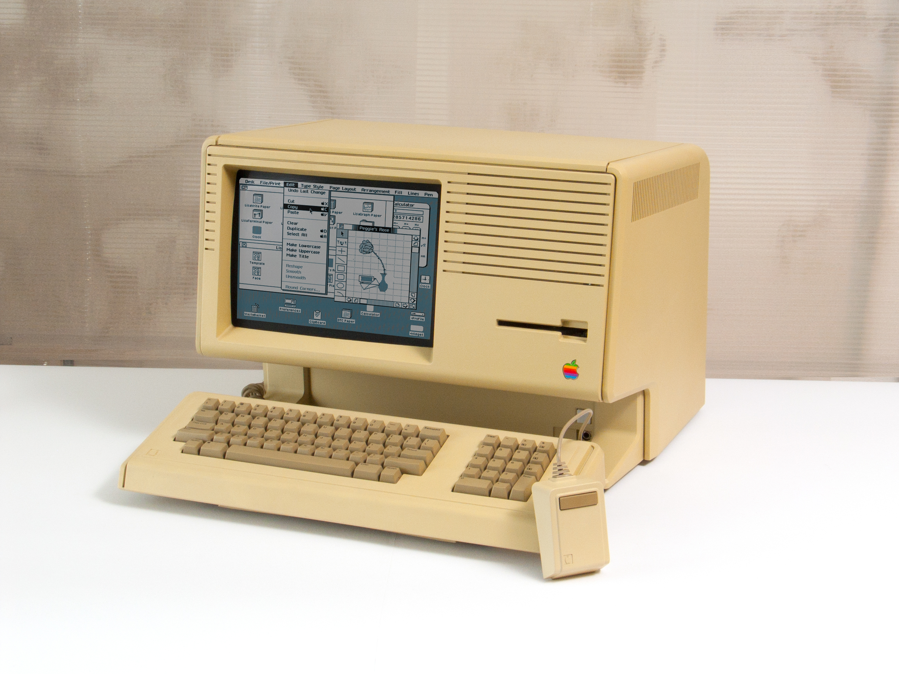

# Rights, Operating Systems and ⿻ Freedom

Each day, Luna navigates a labyrinth of tech,  
From towering giants to startups, a trek.  
Interviews blend into a monotonous dance,  
Jargon-filled words, devoid of values' stance.  
She yearns for projects of substance and worth,  
But opportunities veer from her dreams' birth.

One night, deflated, she sinks into her couch,  
Holographic ads engulf her, a sensory slouch.  
"Nourishing democracy's river," the narration begins,  
Capturing her gaze as the manifesto spins.  
Fatigue fades as her mind starts to churn,  
Screen in hand, words illuminating her concern.

"To those crafting digital communication's frame,  
Ensuring privacy, free speech, and equality's flame."  
She imagines a hackathon, debates fierce yet fair,  
Creating controversial yet impactful software.

"To innovators mirroring our best relations,  
Where clicks and interactions build shared celebrations."  
She dreams of heartfelt thanks from children she's aided,  
Buying soda with gratitude, community ties unfrayed.

"To pioneers of digital assets, a toast,  
Empowering choice, economic equality's coast."  
She envisions harnessing her phone's might,  
Buying magical potions, adventuring through the night.

"To creators of digital democracy, a cheer,  
Where governance is a journey, transparent and clear."  
She pictures modernizing her family's ancient vines,  
Adopting UN techniques, progress intertwines.

"To moral compasses, navigating the virtual sea,  
Ensuring digital realms reflect our highest decree."  
Luna realizes her calling transcends mere platforms,  
Building societal pillars, enriching human norms.

"Together, this community isn't just coding software,  
We're sculpting a legacy of compassion and welfare."  
In each digital interaction, a chance to uplift,  
Connecting humanity, mending the rifts.
 
---

Internet founder JCR Licklider (Lick) saw a far wider range of fundamental protocols as foundational to a network society than have thus far been manifest in internet protocols.  Yet his analysis was more a laundry list than a philosophical analysis.  To articulate a clear vision of the foundations of a ⿻ society, in this chapter we draw on the definitional concepts of ⿻ to outline what these protocols should consist of and the role they should play socially.  Then, in the rest of this part of the book, we systematically explore these, the limits to their implementation today and how they might be more fully achieved.

We argue that  ⿻ societies must be founded on infrastructure that matches the principles of ⿻ in both form and structure.  Formally, they must combine seamlessly the closely related political idea of a system of rights and technological concept of an operating system.  Substantively they must allow the digital representation of societies in the terms ⿻ understands them: as diverse, intersecting social groups and people that jointly undertake ambitious and inclusive collaborations.

### Rights as foundation of democracy

Rights are a ubiquitous feature underpinning democratic life. Most simply imagined, democracy (etymologically "rule of the people") is as a system of government, of collective decision-making by the people, rather than a set of actions a government takes towards its people. Yet evolving from its ancient Athenian origins, shaped by Enlightenment philosophy and forged through revolution, democracy came to also enshrine a set of fundamental freedoms and rights. While these "rights" have varied across across democracies in both time and space, broad patterns are not only identifiable, but have formed the foundation of documents such as the [United Nations Universal Declaration of Human Rights](https://www.un.org/en/about-us/universal-declaration-of-human-rights) (UDHR), including equality, life, liberty, personal security, speech, thought, conscience, property, association—to name a few. While there are important debates around the edges of these principles, in broad outlines they define and defend core aspects of the nearly universal characteristics of human behavior as [highlighted](https://www.hachettebookgroup.com/titles/nicholas-a-christakis-md-phd/blueprint/9780316230056/) by leading anthropologists like Nicholas Christakis.[^Blueprint]  These include what Christakis calls the "social suite", the nearly universal tendency of humans to have a sense of personal identity, to form familial relationships as well as long-term friendships, for these to form the basis of broader cooperative social networks and groups towards which members are "biased", to have differentiated trust within these networks based on relationships and capacities and to learn from each other.

[^Blueprint]: Nicholas A. Christakis, *Blueprint: The Evolutionary Origins of a Good Society* (New York: Little Brown Spark, 2019).

Regardless of the precise makeup and universality, however, what we are most interested in is why they are so integral to democracy as a system of government and why so many people and organizations believe a democracy cannot exist without protecting these rights. In her recent book, *[Justice by Means of Democracy](https://press.uchicago.edu/ucp/books/book/chicago/J/bo192735333.html)*, leading ⿻ political philosopher [Danielle Allen](https://en.wikipedia.org/wiki/Danielle_Allen) provides a clear account of this connection: government cannot respond to the "will of the people" if their will cannot be safely and freely expressed.[^JbmD] If voting one's conscience is personally dangerous, there is no reason to believe that outcomes reflect anything other than a coercer’s will. If citizens cannot form social and political associations free of  duress, they cannot coordinate to contest decisions by those in power. If they cannot seek livelihood through a diversity of economic interactions (for example, because they are enslaved either by the state or a private master), we should expect their expressed politics to obey their masters, not their inner voice. Without rights, elections become shams.

[^JbmD]: Danielle Allen, *Justice by Means of Democracy* (Chicago: University of Chicago Press, 2023).

Many prominent democracies have "committed suicide" through undermining the rights from which they were forged. Perhaps the most famous example was the Weimar Republic that governed Germany for most of the 30 years between the World Wars and ended in the election of the National Socialist German Workers (Nazi) party to a plurality of seats in the parliament, or Reichstag. This famously led to the appointment of Adolf Hitler as Chancellor.[^Evans] Yet, today many democratic societies have elected leaders and governments that have curtailed liberties in a manner that converts them from democracies to what political scientists Steven Levitsky and Lucan A. Way have labeled "[competitive authoritarian](https://www.cambridge.org/core/books/competitive-authoritarianism/20A51BE2EBAB59B8AAEFD91B8FA3C9D6)" regimes.[^Levitsky] Concerns about unfree societies undermining democratic functioning are neither abstract nor theoretical, but current. 

[^Evans]: Richard Evans, *The Coming of the Third Reich* (New York: Penguin, 2005).
[^Levitsky]: Steven Levitsky, *Competitive Authoritarianism: Hybrid Regimes after the Cold War* (Cambridge, UK: Cambridge University Press, 2012).

Almost all democracies share a focus, and expect others to share a focus, on the preservation of some strongly overlapping set of such rights of speech and association as basic preconditions for democratic functioning. For example, Scandinavian countries have emphasized the importance of what might be called "positive freedom of speech," namely that every citizen regardless of means has a viable path for their voice to be heard, whereas others such as the US, emphasize "negative freedom of speech," that no one may impede through government intervention the expression of a view. Some societies (e.g. in Europe) tend to emphasize the importance of privacy as a fundamental right necessary for civil society to exist independent of the state and thus for politics to be possible. Others (e.g. in Asia) tend to emphasize rights of assembly and association as more central to democratic function. Despite these variances, the underlying assumption of rights of speech and association is that they protect agency, so citizens may have autonomy to form and advance associations for their common interests, so these common interests can be heard politically. 

National (and subnational) governments, especially judicial systems, often play a critical role in ensuring that rights are respected and adjudicating their boundaries. Yet thinking of rights only in terms of national legal systems is misleading. Rights represent  deeply held beliefs and values rooted in a range of diverse cultural contexts  (national, subnational, transnational, etc.). Rights not only  carve the possibility space for human action, they confer  legitimacy. For example, private workplaces or internet platforms generally may restrict speech. Yet expectations of rights of free speech put severe limits on the kinds of restrictions on speech employees and customers are willing to accept. Similarly, although documents like the UDHR are generally not legally binding, they still inspire and influence laws in many countries, including decisions made by the Supreme Court of Appeal in South Africa.[^SAintl] Institutions of different scales (courts, corporations, civil society groups, etc,) are crucial in ensuring these shared cultural expectations are upheld, and no one institution on their own is the "enforcer" or "source" of rights.  Furthermore, many religious traditions hold that the source of rights is divine rather than earthly. In this sense, rights may be thought to exist across, above and beyond states, even if states are one critical defender of them.

[^SAintl]: Hurst Hannum, "The Status of the Universal Declaration of Human Rights in National and International Law" *Georgia Journal of International and Comparative Law* 25, no. 287 (1995-1996): 287-397.

Rights are also often aspirations and goals, rather than fixed and attainable realities. Much of the history of the US is a drama about the fulfillment of founding aspirations to equality that were long denied.[^Lepore] Many positive rights (e.g. a quality education, decent housing) are outside the capacity or mandate of governments, especially in developing countries, to immediately deliver but nonetheless are testaments to the deepest aspirations of a people.[^Greene]

[^Lepore]: Jill Lepore, *These Truths: A History of the United States* (New York: Norton, 2018).
[^Greene]: Jamal Greene, *How Rights Went Wrong: How our Obsession with Rights is Tearing America Apart* (Boston: Mariner, 2021).

### Operating systems as foundation of applications

Operating systems (OSs) are a ubiquitous feature underpinning digital life. Almost every digital interaction you have had depends on an underlying OS. [Linux](https://www.linux.org/) is the most ambitious and successful open-source software project of all time. [Windows](https://www.microsoft.com/en-us/windows?r=1), produced by one of our employers, is another ubiquitous piece of software. [iOS](https://www.apple.com/ios/ios-17/) and [Android](https://www.android.com/) power most smartphones. 

OSs roughly define the possibility space for applications that run on them. There are basic traits in terms of performance, appearance, speed, machine memory usage—to name a few—that applications running on a particular OS share and must respect to work on that platform. For example, iOS and Android allow for touch interfaces, while earlier smartphones (like the [Blackberry](https://en.wikipedia.org/wiki/BlackBerry) or [Palm](https://en.wikipedia.org/wiki/Palm,_Inc.)) relied on styluses or keyboard entry. Even today, iOS and Android apps have different looks, feels and performance characteristics. Applications are coded for one (or possibly multiple) of these platforms, drawing on the processes built into the OS to determine what their application can and cannot do, what it has to build bespoke and what it can rely on underlying processes for.

Boundaries are rarely sharp. While [Macintosh](https://en.wikipedia.org/wiki/Mac_(computer)) was the first mass-market computer with a graphical user interface ([GUI](https://en.wikipedia.org/wiki/Graphical_user_interface)) OS
, earlier computers with a command-line interface sometimes had programs that included elements like a GUI. Similarly, while virtual (VR) and augmented reality (AR) headsets (see our chapter on [Immersive Shared Reality](https://www.plurality.net/v/chapters/5-2/eng/?mode=dark) below) are much more effective today, there are some VR and AR experiences that can run on a smartphone, properly worn on the head. Furthermore, while OS designers try to include security protocols that defend against application behaviors that violate or threaten the integrity of the underlying OS, they can never hope to avoid them entirely.[^WorldEnds] Many, perhaps most, computer "viruses" are precise examples of such violations. OSs thus define the normal behavior of applications on their system, providing tools applications can harness and reasonable expectations they can have about other applications, defining the terrain of the easily possible.

[^WorldEnds]: Nicole Perlroth, *This is How They Tell Me the World Ends: the Cyberweapons Arms Race* (New York: Bloomsbury, 2021).

OSs constantly must adapt to unanticipated behaviors by applications, both desired (so as to empower new applications) and undesired to defend against viruses. These adaptations may be minor and superficial; for example, we often receive updates to the OSs on smartphones to defend against security threats. Or, over time phones have transitioned away from users typing "emoticons" and "emojis" with character combinations to natively integrating them into the OS's typing features.[^Emoji] Other changes are more dramatic: for example, Google introducing Android versions compatible with cars and televisions. 
[^Emoji]: Gretchen McCulloch, *Because Internet: Understanding the New Rules of Language* (New York: Riverhead Books, 2019).

OSs also defend their integrity in a variety of ways; while security patches are the sharpest and most adversarial, they coexist with developer education, the building of a broad ecosystem of developer support, the gradual development of customer usage and expectations, and more. Applications built on an OS not only support its internal development but also facilitates updates and even new OSs that can enhance or even rival the original OS. And while different OSs differ and compete, they share many common affordances. They at least partially attempt to allow cross development and both backward and forward compatibility, so that applications designed for previous versions continue to work and that applications are "future proof" to new generations, thereby ensuring users access to a wide range of applications.

OSs are almost always works-in-progress. They aim to support and foster functionality they are incompletely able to support. From these repeated attempts, they recursively learn to offer better support. For example, the first prominent audio "smart assistant" released (such as Apple's [Siri](https://www.apple.com/siri/) and Amazon's [Alexa](https://www.alexa.com/)) were often comically low quality; quality improved over time with user participation through the systems themselves, enabling more profound oral functions over time in these operating systems.

### ⿻ foundations

Systems of rights and OSs have many common traits: they serve as foundations for the democratic societies and applications that run on top of them, have background conditions assumed in their processes, require special defense and protection to ensure the integrity of a system, and nonetheless, are often at least partly aspirational and incompletely fulfilled, at times in tension internally. And while they are often backed by powerful enforcement mechanisms, they are also part of a diffuse culture in addition to sharply defined [institutions and code](https://lessig.org/product/code/).[^CodeasLaw] Beyond these general parallels, however, there are two aspects of both rights and OSs that are particularly important and distinctive to a ⿻ perspective, which we will draw out and contrast to Libertarian and Technocratic approaches.

[^CodeasLaw]: Lawrence Lessig, *Code: And Other Laws of Cyberspace* (New York: Basic Books, 1999).

#### Dynamism 

OSs are self-evidently dynamic, just as systems of rights are, on reflection, are. This dynamism is central to ⿻. Rights support the democracies that rest on them and OSs support the applications that run on top of them. But the framers of rights and designers of OSs cannot anticipate (or cannot see except "[through a glass darkly](https://www.biblegateway.com/passage/?search=1%20Corinthians%2013%3A12&version=KJV)") how these foundations will be used, abused and reimagined, as different and sometimes adversarial actors harness (often through technological means) precisely the space they provide for such experimentation and innovation. The PRC’s [Great Firewall](https://en.wikipedia.org/wiki/Great_Firewall), for example, restricts and censors internet content, codifying authoritarianism. Yet, global social media platforms endemic to democracies today [have sometimes](https://digitalcommons.unl.edu/senatedocs/2/) auctioned the attention of their customers including with micro-targeting  for election interference and misinformation by adversaries.[^DiResta] Continued effective facilitation of democratic conversation will therefore require not just avoiding of censorship, but also of the sale of the attention economy to authoritarian influences, as highlighted by the recent international debate [over potential authoritarian influences](https://www.economist.com/business/2024/03/13/will-tiktok-still-exist-in-america) on the short-form video application, TikTok.[^EconomistTikTok]

[^DiResta]: Renee DiResta, Kris Shaffer, Becky Ruppel, David Sullivan, Robert Matney, Ryan Fox, Jonathan Albright and Ben Johnson, "The Tactics & Tropes of the Internet Research Agency" (2019), presented to the Congress of the United States, available at https://digitalcommons.unl.edu/senatedocs/2/.
[^EconomistTikTok]: *The Economist*, "Tick, Tock: Will TikTok Still Exist in America?" March 13, 2024.

Thus our understanding of free speech, once considered the primary expression of a right that ensures citizens can freely form and build support for political positions, is being challenged as a result of information technology. This assumption was founded on an environment where information was scarce and thus its suppression was one of the more effective ways to avoid voices being heard. The present environment is different: information is abundant and attention scarce. Thus it is often easier for adversaries who seek to suppress or censor inconvenient views (attacking the foundations of democracy) to simply flood the information commons with distractions and spam, rather than try to suppress dissidents and unwanted content ([documented dramatically](https://www.cambridge.org/core/journals/american-political-science-review/article/how-the-chinese-government-fabricates-social-media-posts-for-strategic-distraction-not-engaged-argument/4662DB26E2685BAF1485F14369BD137C) by the research of Gary King, Jennifer Pan and Molly Roberts).[^Roberts] Under such attacks, ensuring diverse, relevant and genuine content is surfaced for attention is the challenge, not (only) preventing literal censorship. We suspect our protections around free speech will need to evolve correspondingly and discuss pathways to ensure this happens below.

[^Roberts]: Gary King, Jennifer Pan and Margaret E. Roberts, "How the Chinese Government Fabricates Social Media Posts for Strategic Distraction, Not Engaged Argument", *American Political Science Review* 111, no. 3 (2017): 484-501.

Yet dynamism is not desirable for its own sake, nor should it be used in a ⿻ vision to subsume the entire structure in the pursuit of some total ultimate goal. Instead dynamism is an emergent property of adaptive systems discovering their future while renewing and improving their ability to continue to adapt in the future, self-organizing to the "edge of chaos" where complexity thrives and grows. OSs and rights can and should evolve to support the applications and democracies that run on top of it, rather than collapsing to an external will—whether it be the narrow profit interest of a company or some national interest.

#### Rights and relationships

A ⿻ understanding of rights recognizes systems and groups as much as people. Freedom of association and religion protect associations and religions themselves, as much as those who compose them. Federalist systems, like the US Constitution, recognize rights of states and localities, not simply individuals. Even commercial freedoms, while often conceived of in terms of individual choices and bilateral exchange, usually protect at least as vigorously the rights of corporate entities and their contractual arrangements, and rights to collective bargaining. Similarly, OSs protect the interactions between applications and users, as much as applications and users separately. Thus, while some elements of a system of rights or OSs may be thought of as protecting or servicing individual users, there is nothing inherently individualistic about them. Similarly, speech, as a form of communication, necessarily involves more than one party. Whether within OSs or in “the public square,” the viability of a communication network depends on the collective participation and consent of its many willing applications, users, and groups.

Furthermore, the entities protecting and defending these freedoms are rarely simply nation states and their associated institutions. Commercial law is a leading example. As scholars such as [Anne-Marie Slaughter](https://press.princeton.edu/books/paperback/9780691123974/a-new-world-order) and [Katharina Pistor](https://press.princeton.edu/books/hardcover/9780691178974/the-code-of-capital) have highlighted, international networks of legal rules, trade agreements and mutual respect for precedents are (for better or worse) central to important topics like intellectual property, antitrust and capital requirements for financial institutions.[^NetworkLaw] Each of these is governed by a different network of professionals, international institutions, and even lobbying groups. Thus, rights are not just held by a diversity of groups forming an interacting network; they are also defined by a similar intersecting network of cultures, institutions and agents. Rights emerge from intersecting people and social circles defending and protecting their networks of social interactions.

[^NetworkLaw]: Anne-Marie Slaughter, *A New World Order* (Princeton, NJ: Princeton University Press, 2004). Katharina Pistor, *The Code of Capital: How the Law Creates Wealth and Inequality* (Princeton, NJ: Princeton University Press, 2019).

#### Contrast with Libertarianism and Technocracy

The dynamic, networked, and adaptive foundations of ⿻ rights and OSs that respectively support democratic exploration and the evolution of application environments stand in stark contrast to the political and technical monistic perspectives embodied in the ideologies of Libertarianism and Technocracy. Libertarianism is grounded in a rigid and “immutable” set of well-defined historical rights, which primarily emphasize individual private property and the prevention of any "violence" that challenges these property relations. Under this view, rights are abstracted or detached from both other rights and any social or cultural context from which they emerged, rights belong exclusively to atomic individuals and technical systems ought to insulate these rights as thoroughly and completely from any change or social intrusion as possible. On the other hand, Technocracy is rooted in the notion of an "objective," "utility" or "social welfare" function that technical systems are designed to “align to” and maximize. Where Libertarians sees rights as absolute, unambiguous, static, and universal, the Technocrats deem them as mere obstacles, or encumbrances, in the pursuit of a definable social good.

### ⿻ freedom

However skeptical one may be of a future immersed in digital simulated worlds (sometimes called "metaverses"), few would deny that many people live large parts of their lives online these days. In that growing part of our lives, what we  do, say, and trade is constrained by the possibilities offered by our technologies that network us together—and thus weave our social fabric.  The protocols that connect us thus define our rights in the digital age, forming the OS on which societies run. Intellectually and philosophically, the ⿻ tradition we described in our chapter on [Connected Society](https://www.plurality.net/v/chapters/3-2/eng/?mode=dark) focuses on the need to move beyond the simplistic frameworks for property, identity and democracy on which liberal democracies have been built in favor of more sophisticated alternatives that match the richness of social life. Technologically, the early networking protocols that provided a governance framework for intercomputer communication attempted precisely to accomplish this, fusing together the parallel but distinct ideas of rights and OSs. Here, interpersonal networking OSs aimed to provide the fundamental capacities to participants needed to support a ⿻ conception of rights. 

Because technological systems are instantiated in formal mathematical relationships, a simple way to see what this requires is to use the canonical mathematical model that directly corresponds to ⿻ description of society: the "hypergraph" as pictured in the figure.  A hypergraph, which extends the more common idea of a network or graph by allowing groups rather than just bilateral relationships, is a collection of "nodes" (viz. people, represented by the dots) and "edges" (viz. groups, represented by the blobs).  The shade of each edge/group represents the strength of the relationship involved (viz. mathematically its "weight" and "direction"), while the digital assets (e.g. data, computation and digital storage) contained in the edges represent the collaborative substrate of these groups.  Any such digital model is, of course, not literally the social world but an abstraction of it and for real humans to access it requires a range of digital tools, which we represent by the arrows entering into the diagram.  These elements constitute jointly a menu of rights/OS properties which each of the next five chapters articulates one of more completely: [identity/personhood](https://www.plurality.net/v/chapters/4-1/eng/?mode=dark), [association](https://www.plurality.net/v/chapters/4-2/eng/?mode=dark), [commercial trust](https://www.plurality.net/v/chapters/4-3/eng/?mode=dark), [property/contract](https://www.plurality.net/v/chapters/4-4/eng/?mode=dark) and [access](https://www.plurality.net/v/chapters/4-5/eng/?mode=dark).

The project of constructing shared digital protocols to reflect these is in nascent stages, as we highlighted in our chapter [The Lost Dao](https://www.plurality.net/v/chapters/3-3/eng/?mode=dark) and as increasingly accepted by many leading [civil actors](https://www.projectliberty.io/).[^Ford] Most of the natural, fundamental affordances of networking are not available to most people even in wealthy countries as basic parts of the online experience. There is no widely adopted, non-proprietary protocol for identification[^IDprotocols] that protects rights to life and personhood online, no widely adopted non-proprietary protocols for the ways we communicate [^MIMI] [^MLS] [^DIDComm] and form groups online that allows free association, no widely adopted non-proprietary protocols for payments to support commerce on real–world assets and no protocols for the secure sharing of digital assets like computation, memory[^FFC] and data[^holoChain] that would allow rights of property and contract in the digital world. Many of these services are almost all controlled and often quasi-monopolized by nation state governments or more often by private corporations.  And even the basic conception of networks that lies behind most approaches to addressing these challenges is too limited, ignoring the central role of intersecting communities. If rights are to have any meaning in our digital world, this has to change.

[^Ford]: Jenny Toomey and Michelle Shevin, "Reconceiving the Missing Layers of the Internet for a More Just Future", *Ford Foundation* available at https://www.fordfoundation.org/work/learning/learning-reflections/reconceiving-the-missing-layers-of-the-internet-for-a-more-just-future/.  Frank H. McCourt, Jr. with Michael J. Casey, *Our Biggest Fight: Reclaiming Liberty, Humanity, and Dignity in the Digital Age* (New York: Crown, 2024).  McCourt has founded [Project Liberty](https://www.projectliberty.io/), one of the largest philanthropic efforts around reforming technology largely based on this thesis.

Luckily, it has begun to. A variety of developments in the past decade have fitfully taken up the mantle of the "missing layers" of the internet. This work includes the "[web3](https://readwriteown.com/)" and "[decentralized web](https://www.theatlantic.com/technology/archive/2022/10/internet-archive-decentralized-web-web3-brewster-kahle/671647/)" ecosystems, the [Gaia-X](https://en.wikipedia.org/wiki/Gaia-X) data sharing framework in Europe, the development of a variety of digital-native currencies and payment systems and most prominently growing investment in "[digital public infrastructure](https://www.undp.org/digital/digital-public-infrastructure)" as exemplified by the "[India stack](https://indiastack.org/)" developed in the country in the last decade. These efforts have been underfunded, fragmented across countries and ideologies and in many cases limited in ambition or misled by Technocratic or Libertarian ideologies or overly simplistic understanding of networks. But they together represent a proof of concept  that a more systematic pursuit of ⿻ is feasible. In this part of the book, we will show how to build on these projects, invest in their future and accelerate our way towards a ⿻ future.

[^IDprotocols]: Closed proprietary namespaces and globally managed registries (see “Decentralized Identifiers (DIDs) V1.0.” W3C, July 19, 2022, https://www.w3.org/TR/did-core/) as well as verifiable credentials that support collection of credentials from a variety of sources (see “Verifiable Credentials Data Model 1.0.” W3C, March 3, 2022. https://www.w3.org/TR/vc-data-model/.) 
[^MIMI]: “More Instant Messaging Interoperability (Mimi),” Datatracker, n.d. https://datatracker.ietf.org/group/mimi/about/.
[^MLS]: “Messaging Layer Security,” Wikipedia, January 31, 2024, https://en.wikipedia.org/wiki/Messaging_Layer_Security.
[^DIDComm]: “DIDComm v2 Reaches Approved Spec Status!” Decentralized Identity Foundation, July 26, 2022, https://blog.identity.foundation/didcomm-v2/.
[^FFC]: See Filecoin Foundation (https://fil.org/) and IPFS (https://www.ipfs.tech/)
[^holoChain]: See Holochain (https://www.holochain.org/)
