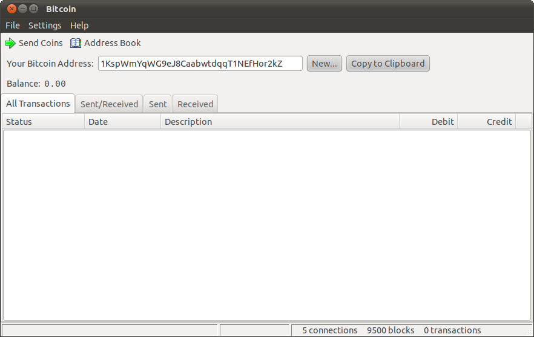

# Commerce and Trust

The ambient hum of excitement echoed through the open-air, punctuated by distant laughter and chatter. Local families had gathered once more for the beloved retro cinema night—a tradition deeply cherished in this community. Like a canvas of memories, families, lovers, and teens lounged on camping chairs, ready to relive moments from an old movie under the vast expanse of the starlit sky.

Amidst the seasoned attendees was Zvi, standing out with an air of novelty. New to town and having only recently taken up a teaching position at the local school, he was keen to mingle and partake in community festivities. Grasping a bag of chips he intended to share, he joined the queue, absorbing the unique spirit of the evening.

"Thank you for your street art contributions," a voice echoed from the front. Zvi turned his attention to the ticketing booth. Charity event? I wasn’t aware, he thought, slightly puzzled.

"I would love us to watch Rogue Stardust.” Zvi craned his neck and caught sight of a familiar face, a student from his school, proudly flaunting her school hoodie.

That's unexpected, he mused.

His musings were interrupted as he overheard another exchange, "Ma'am, which movies would you like to choose for tonight, you have several votes from your nursing home and community work."

A gentle, elderly voice responded, "I'd prefer Whispers in the Void and The Last Alchemist, if you don’t mind.”

"Thank you for your contributions, ma'am." the man at the booth responded, his tone courteous.

Soon, it was Zvi’s turn. The man at the booth had an aura of tranquility, reminiscent of a seasoned surfer. His warm smile was contagious.

"Good evening, sir! If you’d like, you can tap your phone here to share your community experiences. It’s completely optional but a nice way for us to acknowledge everyone’s contributions to our town,” the attendant offered, gesturing towards a small, unobtrusive screen on the counter.

Zvi, intrigued yet cautious, queried, “And what happens if I do? Just curious about privacy and all.”

“Of course, privacy is key. This device simply displays public community messages and thank-you notes on our local community app. It’s the same info anyone can see on the app. Think of it as a digital way of saying thanks and sharing positive vibes," the attendant explained, his tone reassuring.

Zvi, feeling at ease with the explanation, decided to participate. He tapped his phone on the device, and the screen lit up, displaying a colorful array of thank-you messages and fun emojis from local residents, acknowledging his recent help with community projects.

Smiling at the warm messages, Zvi replied, “That’s a nice touch. Makes you feel part of something special.”

“Exactly! And as a part of our community, you get to suggest a movie for tonight. What would you like to add to the lineup?” the attendant asked, his eyes twinkling with friendliness. "Also, thank you for taking the time to help my sister's child after school that day; it truly made a difference for her family."

The warmth of acceptance spread through Zvi as he realized he had been welcomed. With a nod of heartfelt thanks, he made his way to a comfortable nook within the gathering, sharing his crackers with the delighted children nearby.

Beneath a sky speckled with stars, against a backdrop laden with memories, Zvi watched as his cherished film began to play. In this moment, he was enveloped by the profound sense of community—where he was not merely a spectator, but an integral thread woven into the vibrant tapestry of collective memories and experiences.

---

It's a testament to the commercial nature of the contemporary world that none of the protocols we discuss in this section have received nearly the attention in media and policy as new approaches to facilitating payment and commerce. Cryptocurrencies have been one of the focal technologies of the last decade. But only slightly less heralded and far more broadly adopted have been a range of government and other public payments innovations including instant payments technologies using government identities in places like [India] (https://www.npci.org.in/what-we-do/upi/product-overview), [Brazil](https://www.bcb.gov.br/en/financialstability/pix_en) and [Singapore](https://www.abs.org.sg/consumer-banking/fast), central bank digital currencies (CBDCs), and regulated inter-operable digital payment systems like those used in the People's Republic of China (PRC). While they are far from universally adopted or inter-operable, a new generation of payment systems are increasingly prevalent in the lives of many people around the globe, making payment in digital spaces increasingly as easy or easier than what cash facilitated in the past.

Yet, in many ways the relatively rapid success of these efforts is a symptom of what is so disappointing about their progress so far. Cash is perhaps one of the "dumbest" technologies of the pre-digital era: it is a single, homogeneous substance transmitted between roughly anonymous, abstracted accounts. While it has proven far harder to replicate this basic function, and thus recent advances are important, this is not a revolutionary technique enabled by digital technology as, for example, hypertext improved on what had been possible in previous writing. In this chapter we will summarize progress thus far, discuss the limitations of traditional money compared to higher aspirations for commerce online and discuss ways to build on recent advances to allow a more ⿻ vision of digital commerce.

### Traditional payments

While the early history of money has been a subject of a great deal of recent research, to which we will return below, most people associate the idea with currency in the form of tokens or notes that pass from one hand to another and view other forms of money as abstractions of this more basic concept. This form of "money of exchange" dates back to the early civilizations of Babylon, India and China and in the first millennium BC was increasingly based on precious metals like bronze, silver and gold.[^Davies] The durability, scarcity and wide belief in the value of these metals facilitated broad acceptance of them in payment for a range of goods and services.

[^Davies]: Glyn Davies, _A History of Money_ (Cardiff, UK: University of Wales Press, 2010).

Yet none of these properties pertain exclusively to precious metals and their use as currency detracted from more practical applications, whether to weapons, machinery or decorations. This led many societies to move away from direct use of precious metals to other representations of their value that could be made scarce but had no direct use, including commercial receipts, bank notes and government-issued paper that was deemed "legal tender" and thus mandated to be accepted for its face value.

Closely connected was the development of banks, which held currency and other valuables that they promised to return on demand, using these deposits to fund lending to others. Because banks are rarely simultaneously called on to return the full set of deposits, they began to lend out more than they had on deposit, giving rise to a system of "fractional reserve banking" and making banks a source of the creation of new money. While the obvious dangers of a bank run this creates are not a topic we have space to focus on here, they created a natural role for "central banks" to help control this process of money creation and avoid banking collapses.

By the early twentieth century, the overwhelming majority of money was held as accounts, rather than currency (paper or otherwise). Given its rigid denominations and bulk, currency is only effective for relatively small transactions. In parallel to, and arguably earlier than currency, directed transfers between bank accounts with flexible denominations developed, typically called "cheques" today. By the mid-twentieth century, these had become the dominant (by aggregate value) method of funds transfer. Cheques came, and come, in a variety of forms, some more reliant on information exchanges across banks and others operating more similarly to cash (unconditional and undirected value transfers).

Cheques, of course, have familiar disadvantages of being slow to both fill out and in order to clear must be sent around physically. Beginning in the late nineteenth century, some stores began to issue tokens representing "credit accounts" for regular customers and utopian writers like Edward Bellamy began to imagine a world where all payments could be conducted using one or a few lightweight cards.[^Bellamy] In 1928, Charga-Plate, an early predecessor of the credit card, began operations.[^Charga] Over the following three decades, the use of cards to "buy now, and pay later" gradually expanded first through the airline industry and later through dining.[^cards]

[^Bellamy]: Edward Bellamy, _Looking Backward_ (Boston, Ticknor & Co., 1888).
[^Charga]: It was a 64 mm × 32 mm rectangle of sheet metal related to Addressograph and military dog tag systems. It sped up back-office bookkeeping and reduced copying errors that were done manually in paper ledgers in each store.
[^cards]: In 1934 American Airlines offered an Air Travel Card, passengers could "buy now, and pay later" for a ticket against their credit and receive a fifteen percent discount at any of the accepting airlines. By the 1940s, all of the major U.S. airlines offered Air Travel Cards that could be used on 17 different airlines. The concept of customers paying different merchants using the same card was expanded in 1950 by Ralph Schneider and Frank McNamara, founders of Diners Club, to consolidate multiple cards.

In 1958, Bank of America launched the BankAmericard, which would become the first successful recognizably modern credit card, which was eventually licensed to other banks around the United States and then around the world.[^Americard] This system was computerized in 1973 under the leadership of Dee Hock, the first CEO of Visa, allowing reduced transaction time, with magnetic strips easing processing. In 1976, all BankAmericard licensees united themselves under the common brand Visa, organized as a bank consortium to manage networks of agreements between banks. During the 1980s, electronic merchant terminals allowed for increasingly wider and faster acceptance of the cards, further accelerated in the 2000s when chips and PINs were widely added.

[^Americard]: Bank of America chose Fresno because 45% of its residents used the bank, and by sending a card to 60,000 Fresno residents at once, the bank was able to convince merchants to accept the card..

Cheques clearing systems began to leverage database and telecommunications networks in the 1970s with the develompent of Automated Clearing Houses (ACHs). These process large volumes of credit and debit transactions between accounts at banks in batches on a net settlement basis. This system supports government payments to people (employees, pensioners) Employer payments to employees, business-to-business payments, consumer to bank payments (mortgages) and other such transactions made from one bank account to another. The first ACH, BACS began operation in the UK in 1968, in the US the first one, operated by the Federal Reserve Bank of San Francisco began processing transactions in 1972. By 2012 there ware 98 ACH systems.[^IBRD]

This acceleration of electronic transfers led banks themselves to consider how to transfer money internationally and in 1973 they came together to form, Society for Worldwide Interbank Financial Telecommunication (SWIFT) a co-operative they all own and manage. SWIFT is a carrier of messages containing the payment instructions between financial institutions involved in a transactio".[^Swift]. By 2018 messages about half of all high-value cross-border payments went through its network. [^Swift2]

Until roughly the last decade, this constellation covered most transactions. A mix of cash and payments cards were used for small value transactions in physical proximity and wires were used to send money abroad, while larger value transactions flowed primarily over ACHs and to a lesser extent wires and cheques. All of these systems predate the emergence of the internet and none of them match its reach, pace or flexibility: payment cards were traditionally cumbersome and insecure to use online, cash irrelevant and ACHs far too slow (typically 3 days). Unsurprisingly, therefore, Lick, Tim Berners-Lee, Nelson and others believed a native payment system was one of the core features missing from the early development of the internet. The last decade and a half has seen a variety of attempts to address this lacuna.

### Digital money and privacy

One of the first and the most attention-grabbing of these was the emergence of [Bitcoin](https://en.wikipedia.org/wiki/Bitcoin) in 2008 and later a range of other "[cryptocurrencies](https://en.wikipedia.org/wiki/Cryptocurrency)" in the 2010s.[^crypto] These systems used DLTs, like those we discussed in the last chapter, paired with internally generated financial structures to create a validated substrate for tracking transactions. First, instead of an identity system based on accounting for human participants, they used protocols to prove control over some resource (such as "proof of work" protocols based on solving a puzzle that requires access to powerful computers) to protect against predatory participants. This created an effectively financial screen for participation. On the other hand, they rewarded "honest" participants (those whose recording of transactions match others') with "coins" created by including transactions to their own account. The ledger was otherwise openly available to any participant, creating a global, purely financial ledger with pseudonymous accounts that allowed individual people to potentially have many different identitifiers.

[^crypto]: Satoshi Nakamoto, "Bitcoin: A Peer-To-Peer Electronic Cash System" (2008) at https://assets.pubpub.org/d8wct41f/31611263538139.pdf. Vitalik Buterin, "A Next-Generation Smart Contract and Decentralized Application Platform" (2014) at https://finpedia.vn/wp-content/uploads/2022/02/Ethereum_white_paper-a_next_generation_smart_contract_and_decentralized_application_platform-vitalik-buterin.pdf.

The early success of Bitcoin inspired attention and interest for at least three reasons:

1. It seemed to fill the lacuna in the digital payments space mentioned above, allowing relatively easy cross-border transfers.
2. It was one of the first examples of a large-scale and "important" (carrying real financial consequences) online application without a centralized identity and permissioning system.
3. Because of its financial structure and scarcity, it was possible for the value of the coins to rapidly appreciate, which they did over several stretches in the following decade and a half, creating great fortunes, speculation and interest. In fact, one author of this book gained a measure of financial independence due to being compensated in Bitcoin and benefiting from one such run of appreciation.[^Disc0403]

While many governments and mainstream business actors recognized the importance of the first point, they saw decentralization as largely superfluous or wasteful and the speculation around cryptocurrencies as a frivolous and potentially destabilizing bubble. This spurred a number of efforts to re-imagine payment systems for the digital age. The most ambitious efforts were "central bank digital currencies", which have been launched or piloted in dozens of countries, especially in Africa and Asia and are being explored in many others. These most directly respond to the cryptocurrency trend by creating digital, currency-like claims on the central banks.

Yet while holding and trading of currency has become a defining image for many people in recent decades, the accounts above and below suggest this may be a bit of an anomaly in human history. As highlighted by media scholar Lana Swartz in _New Money_, commerce has depended more on communication of and the partially local accounting for _obligations_.[^Swartz] It is thus perhaps not terribly surprising that some of the most widely adopted innovations in payments in the last decade have taken the form of changes to payments processing and account transfers, rather than the creation of "currency" _per se_.

[^Swartz]: Lana Swartz, _New Money: How Payment Became Social Media_ (New Haven, CT: Yale University Press, 2020).

This realization interestingly parallels the development of one of the first major means of online payment, the services of the company that came to be known as [PayPal](https://www.paypal.com/). PayPal was originally conceived by founders Max Levchin, Luke Nosek and Peter Thiel as a new digital currency, but quickly moved to become an internet-compatible payments processor.[^X] Following the early growth of Bitcoin, many other private, rapid and low-cost processors entered the market. These included [Square](https://squareup.com/us/en/payments/online-payments) and [Stripe](https://en.wikipedia.org/wiki/Stripe,_Inc.) (targeting businesses) and [Venmo](https://venmo.com/) (targeting more casual individual-to-individual transactions) all of which were founded in the US in the years immediately following the launch of Bitcoin. Perhaps even more impressive was the rapid spread of very low-cost social payments in the PRC through [WeChat Pay](https://pay.weixin.qq.com/index.php/public/wechatpay) and in the rest of Asia through [Line Pay](https://pay.line.me/portal/global/main). These were rapidly followed by a range of similar services facilitated by the largest technology platforms in the West, such as [Apple](https://www.apple.com/apple-pay/), [Amazon](https://pay.amazon.com/) and [Google](https://pay.google.com/pay/u/0/home).

[^X]: Today's PayPal was a merger of the original PayPal with X.com, founded by Elon Musk, Harris Fricker, Christopher Payne and Ed Ho, the name of which is now being revived by Musk as the successor to Twitter.

Seeking to bring these services at lower cost and more inclusively especially in markets incompletely served by these US and PRC-based services, several major developing-world governments have created publicly supported instant payment services, including Singapore's FAST system in 2014, Brazil's Pix system in 2020 and India's Unified Payments Interface in 2016. Even the US has followed with [FedNow](https://www.frbservices.org/financial-services/fednow) in 2023. While there are still significant impediments to international inter-operation, there is an increasing consensus that the immediate gap in making instant payments online and in person through digital channels has been met.[^value]

Yet the challenges raised by cryptocurrencies cannot be laid to rest quite so easily, as suggested by the resilience of interest and recently currency values in the space. The decline of cash, heralded by defenders of sanction regimes and battlers against financial criminals like economist Kenneth Rogoff, has been bemoaned by privacy advocates and civil libertarians, who argue that the collapse of private payments will have systemic effects individual users fail to account for when choosing how to pay.[^Priv] The oft-touted privacy benefits of Bitcoin have largely proven illusory given that it has become increasingly easy for well-resourced analysts to uncover the controllers of pseudonymous accounts.[^Bitcoinprivacy] However, interest in privacy technology has become a primary focus in the space, stimulating the development of highly private currencies like [Zcash](https://z.cash/) and "mixer" services like [Tornado cash](https://en.wikipedia.org/wiki/Tornado_Cash) on top of other currencies. These have stimulated controversy over the trade-offs between privacy and legal accountability, leading to forceful government actions to shut down various privacy features in some jurisdictions. These conflicts have also been at the root of the challenges achieving seamless international inter-operation for digital payments systems, as countries fight over who can surveil and regulate what activity.

[^Priv]: Kenneth S. Rogoff, _The Curse of Cash_ (Princeton, NJ: Princeton University Press, 2016).
[^Bitcoinprivacy]: Alyssa Blackburn, Christoph Huber, Yossi Eliaz, Muhammad S. Shamim, David Weisz, Goutham Seshadri, Kevin Kim, Shengqi Hang and Erez Lieberman Aiden, "Cooperation Among an Anonymous Group Protected Bitcoin during Failures of Decentralization" (2022) at https://arxiv.org/abs/2206.02871.

Many of these challenges arise from the same kinds of misspecification of issues usually labeled "privacy" that we highlighted in our identity chapter. There is wide agreement, on the one hand, that financial transactions should be protected from inappropriate surveillance. On the other hand, there is a similarly wide agreement that, with appropriate checks and balances, it should be possible to hold individuals and organizations accountable for facilitating criminal activity. The question of how these can be reconciled is essentially the same as those we addressed in the previous chapter: how can a diversity of informational communities partially inter-operate while maintaining their integrity?

After all, financial transactions can never be purely private: they always involve several parties and are at least partly detectable by others in a community where the inflow of transactions affects the economic environment. The goal, then, is not privacy as much as it is contextual integrity: ensuring that this information stays within the affected community unless it is having important and widely recognized spillover effects on other communities (precisely what fiduciary duties, financial and business ethics and, when necessary, law enforcement is meant to capture). And, if it is, it is the community's responsibility to either ensure their culture is not supporting such externally harmful activity or to defend their right to support it if the external claim is unjust.[^pools] The essence of ⿻ "checks and balances" is that the communities involved must become partly aware and involved in such external surveillance, rather than it being asymmetrically and externally imposed.

[^pools]: Recently, interest in explicitly creating communities for such purposes has grown in the Web3 world. Vitalik Buterin, Jacob Illum, Matthias Nadler, Fabian Schär and Ameen Soleimani, "Blockchain Privacy and Regulatory Compliance: Towards a Practical Equilibrium" _Blockchain: Research and Applications_ 5, no. 1 (2024): 100176.

Yet surveillance is only the beginning of responsibilities that communities of various kinds, ranging from lending circles to nations, would have to take on to create such contextually appropriate financial freedom. Little surveillance is mere voyeurism. Instead, it is intended to prevent a range of financial crimes, from fraud to trading with aggressors against international law (sanctions). Beyond such dramatic transgressions, a range of transactions legitimately matter for people other than the transacting parties: sales of drugs and weapons, taking-on of unreported debts that burden someone's ability to repay other debts, taxable sales, and much more. All this suggests why the anonymous and unaccountable image of cash and the centralized control by a government of accounts are both insufficient ways to understand a ⿻ system of commercial trust.

### History and limits of currency

Imagining a more ⿻ alternative brings us back to the history of money and why it evolved in the first place. In his account of the institution, the late anthropological historian David Graeber articulated the view of many of the leading scholars of money such as R. G. Hawtrey, Geoffrey Ingham, L. Randall Wray and Samuel A. Chambers to argue that long before money, societies engaged in a range of mutually beneficial collaboration under norms of reciprocity.[^Debt] These were rarely quantified in terms of formal "value" and followed a range of logics beyond simple bilateral favor trading. For example, the community services of a hunter for a village or an elder might put the community in general in their "debt", making gifts to them customary. The richness and diversity of these traditions made their quantification unnatural, but also hard to extend beyond the Dunbar number we discussed in the [Identity and Personhood](https://www.plurality.net/v/chapters/4-1/eng/?mode=dark) chapter of roughly 150 close associates.

As collaboration and exchange extended across larger distances, times or groups, quantification and recording of debts owed and value given became necessary to manage the complexity. While it seems that the earliest such accounts attempted to record the specifics of a debt in terms of the good or service offered, this similarly became quickly unmanageable and common units of quantification were used to simplify accounting and produce the first notions of "currency". Media of exchange, banks and their notes and various of the other forms of money we discussed above grew as ways of making these accounts more portable. "Credit" thus was more primary than "cash".

But if currency arose as a simplification to deal with the limits of pre-modern information technology, the natural question is whether one might do much better today. Recording more about transactions and other forms of value creation is not just possible today; it is a routine part of most electronic commerce. Reducing all this to a transfer of money is no longer a necessary simplification, it is a projection of an antiquated historical ritual.

Nor is the role of money as a solvent in socially long-distance trust particularly relevant today. One of the most common stories economists tell for the advantage of money based exchanges is "the double coincidence of wants": Person A may have something B wants, but the other may not have anything to directly offer in exchange. Money allows them to easily offer goods or services to C, who may have something A wants, without having to assemble the full group. Yet the role of money in avoiding the need for such "trading cycles" is dated: in fact, economists today regularly use "trading cycles" algorithms directly in a variety of contexts without relying on money, given that modern computation makes them cheap to perform.[^TTC]

[^TTC]: Alvin E. Roth, Tayfun Sönmez and M. Utku Ünver, "Kidney Exchange", _Quarterly Journal of Economics_ 119, no. 2 (2004): 457-488.

Similarly, as we noted in the [Identity and Personhood](https://www.plurality.net/v/chapters/4-1/eng/?mode=dark) chapter, it may once have been necessary to offer someone in a distant land a widely valued token, such as gold, instead of a promise to offer a gift in the future, given the low likelihood of a future exchange. Yet such shorthand is far less important today: with everyone within six degrees of social separation and the accounting for relational trust computationally trivial, today it would be almost as easy to harness interpersonal "debts" in chains of relationships directly as to transfer funds.

A natural question is whether harnessing these new capabilities adds anything meaningful. While we will reserve a detailed discussion of applications of ⿻ commerce and trust to the [next part of this book](https://www.plurality.net/v/chapters/5-7/eng/?mode=dark), it is not hard to imagine why such information is important in appropriately allocating the trust and influence that money confers. Someone who has conferred many small benefits across a local community, but interacted little outside of it, and is single has a very different profile of appropriate social favor than someone who is deeply devoted to their family and profession but has few extra-familial social connections in a large city. These two may deserve the same "degree" of social esteem (if quantifying such is even useful), but the esteem is of very different kinds. The former, for example, would be a far more plausible civic or political leader in her community, while the latter would naturally be entitled to professional esteem and a degree of material comfort.

Furthermore, the very economic theory that typically used to justify the relevance of money confirms this intuition, when applied to social reality. Under certain well-studied conditions, money held by individuals suffices to track value creation. But these conditions require that all goods are private (everything can be consumed by one individual and others' consuming it prevents them from doing so) and production is "submodular", meaning that combining a group of people or assets produces less than the sum of what they could produce separately (the whole is less than the sum of the parts). If, on the other hand, consumption is at least partly social and production may be super-modular, money is a poor or even hopeless way to keep track of value.

Open-source software (OSS) project is an example. Collaboration among multiple individuals often creates greater value than individual actions alone. It is supermodular production. And the resulting products are replicated and provide utility to many people. It is social consumption. In these situations money-based management does not function well. Consider a scenario where two individuals collaborate to create value and both actions are necessary. There is no simple or obvious way to divide any value created among these contributors; the value created is fundamentally joint. Furthermore, if the two participants could engage in multiple possible joint projects, which to prioritize depends on the preferences of both, making choices fundamentally collective, decisions that require logic closer to that of voting than commerce.[^supermodular]

More broadly, in practice, as sociologists have extensively documented, social influence _does_ in practice work in these richer ways. People vote, they gain esteem and authority, develop reputations in a range of contexts: a doctor's lab coat, the standing of an athlete, awards for prestigious academic papers, etc. All of these are sources of influence and command deference from those who regard them highly, allowing the bearer of these marks of status to achieve things someone without them could not.

Of course, these systems are not entirely separate from the commercial sphere: reputations for leadership, nobility, or skill can (sometimes) be monetized by, for example, advertising against or charging for access to the person holding the prestige or by using trust to establish a commercial enterprise harnessing it. But none of these conversions are simple or linear, and, in fact, if one is seen to directly "selling" one's social standing such "selling out" or "corruption" can quickly undermine that standing. Clearly, therefore, the simplest ideas of "sales" and "conversion" are not effective ways to allow money to inter-operate with these other "symbolic media". This makes money nearly useless as a way to quantify, make transparent and scale these other systems. The question, then, is how more ⿻ systems of value might overcome this limitation, a question to which we now turn.

### ⿻ money

While there has been a great deal of excitement about the decentralization of cryptocurrencies, there is an important sense in which any currency that aspires to universality is inherently highly centralized: it creates trust and cooperation by everyone ascribing value to the same thing. A more ⿻ approach can, as in our [Identity and Personhood](https://www.plurality.net/v/chapters/4-1/eng/?mode=dark) chapter, follow either a decentralized/polycentric or distributed structure in a way that roughly parallels our ideas there.

In a polycentric structure, instead of a single universal currency, a variety of communities would have their own currencies which could be used in a limited domain. Examples would be vouchers for housing or schooling, scrip for rides at a fair, or credit at a university for buying food at various vendors.[^LETS] These currencies might partially interoperate: for example, two universities in the same town might allow exchanges between their meal program. But it would be against the rules or perhaps even technically impossible for a holder to sell the community currency for broader currency without community consent.[^PluralMoney] In fact, it was the proliferation of experiments with various currencies, some of them with similar intentions, that inspired then-_Bitcoin Magazine_ writer Vitalik Buterin to conceive Ethereum as a platform for such experimentation, though challenges with secure identities have limited community currency experiments as they make it too easy to sell an account and thus circumvent controls on prohibited transfers.[^DeSoc]

[^PluralMoney]: For more elaboration of this idea, see https://www.radicalxchange.org/concepts/plural-money/.
[^DeSoc]: Ohlhaver, Weyl and Buterin, op. cit.

Such a community currency played a central role in the creation of this book. We used it to measure contributions and to allow contributors to make collective decisions on prioritizing and approving changes to the text in a manner we will discuss later in this book. However, we did not use some of the most sophisticated potential approaches, harnessing the tools from the last chapter. For example, in the future community currencies might be recorded on contextually integral chains that make it hard for currency holders to use the currencies more broadly by preventing their showing others outside the community how much they hold.

A distributed approach would go farther than even a large collection of community currencies, replacing currencies entirely with direct representations of interpersonal debt and trust. In such a system, rather than receiving payment for a good or service, people would effectively "call in a favor" from someone who owes one to them. If you need something from someone who does not owe you a favor, you would leverage the principle of six degrees of separation in the network of "favors owed", as discussed in the Identity chapter. Many potential paths of such favors could be calculated and the total amount of "credit" one can get would be computed by classical computer science algorithms for calculating the "maximum flow" ([maxflow](https://en.wikipedia.org/wiki/Maximum_flow_problem)) that can be flow between two points in a network. While such calculations are obviously impractical for people to make on the fly when they want to buy a coffee, they are trivial for a computer network. Supporting such richer, socially-grounded alternatives to quantifying value primarily through universally fungible currency seems increasingly within reach, with various social currencies (of likes, friends, network centrality, citations, etc.) illustrating first examples of what could become a far richer substrate for future cooperation.[^Verification]

[^Verification]: Nicole Immorlica, Matthew O. Jackson and E. Glen Weyl, "Verifying Identity as a Social Intersection" (2019) at https://papers.ssrn.com/sol3/papers.cfm?abstract_id=3375436. E. Glen Weyl, Kaliya Young (Identity Woman) and Lucas Geiger, "Intersectional Social Data", _RadicalxChange Blog_ (2019) at https://www.radicalxchange.org/media/blog/2019-10-24-uh78r5/.

Of course, this will only be possible with the support of widely adopted protocols, ones that facilitate the formation and validation of community ledgers extending those discussed in the previous chapter and/or ones that facilitate long-distance, networked transmission of trust and "debt" in the way TCP/IP did packets of information. These are the aspirations of open source and internet working committees like the aforementioned [Trust Over IP Foundation](https://trustoverip.org/) and start-up ventures like [Holochain](https://www.holochain.org/). Beyond the important work of establishing basic, high-quality digital native payments systems, it is this next generation of truly networked and ⿻ systems of commercial trust systems that can underpin the ⿻ markets and cooperation we discuss in much of the rest of this book.

### Commerce in a ⿻ society

In particular, establishing trust, credit and value across long social distances lies at the core of both the identity systems we described previously and the systems of contracting and asset use that we focus on in the next chapter. Identity systems are about trusting/credit claims made by someone about a third party. Anyone who accepts an arbitrary number of such claims from someone they do not know well exposes themselves to potentially devastating attacks. On the other hand, accepting some claims about relatively unimportant matters from a less trustworthy source is not too risky. The trust established by a network of verifiers in an identity system is thus _quantitative_ and thus depends on quantification of trust, and consequences for betraying this trust, in networks, precisely the sort of system we described here. At the same time, clearly these systems depend on the technologies of identity and association we developed in the previous chapters, to underpin the definition and information structures of the communities and people who form the network of commercial relationships described here. And, as we will now explore, all are critical to the joint use, contracting over and enterprise harnessing the critical assets of the digital age: computation, storage and data. These ideas should be of particular interest to African communities in which trust-based ⿻ and open-source social systems, interacting with mobile and digital technologies, indigenously invented the concept of mobile money, and set the pace for a burgeoning fintech industries[^AfricaInnovation] while grappling with identification system gaps[^IdentificationAfrica].

[^Debt]: David Graeber, _Debt: The First 5,000 Years_, (Brooklyn: Melville House, 2014). See also Ralph Hawtrey, _Currency and Credit_, (London, Longmans, 1919); Larry Randall Wray, and Alfred Mitchell Innes, _Credit and State Theories of Money: The Contributions of A. Mitchell Innes_, (Cheltenham: Edward Elgar, 2014); and Samuel Chambers, _Money Has No Value_, (Berlin: Walter de Gruyter GmbH & Co KG, 2023).
[^IBRD]: “Global Payment Systems Survey (GPSS),” World Bank, January 26, 2024. https://www.worldbank.org/en/topic/financialinclusion/brief/gpss#:~:text=The%20Global%20Payment%20Systems%20Survey%20%28GPSS%29%2C%20conducted%20by.
[^Swift]: Susan Scott, and Markos Zachariadis, _The Society for Worldwide Interbank Financial Telecommunication (Swift)_: _Cooperative Governance for Network Innovation, Standards, and Community_, (New York, NY: Routledge), pp. 1, 35, doi:10.4324/9781315849324.
[^Swift2]: Martin Arnold, “Ripple and Swift Slug It out over Cross-Border Payments,” _Financial Times_, June 6, 2018, https://www.ft.com/content/631af8cc-47cc-11e8-8c77-ff51caedcde6.
[^supermodular]: Divya Siddarth, Matthew Prewitt, and Glen Weyl, “Supermodular,” The Collective Intelligence Project, 2023. https://cip.org/supermodular.
[^AfricaInnovation]: Omoaholo Omoakhalen, “Navigating the Geopolitics of Innovation: Policy and Strategy Imperatives for the 21st Century Africa,” Remake Africa Consulting, 2023, https://remakeafrica.com/wp-content/uploads/2023/12/Navigating_the_Geopolitics_of_Innovation.pdf.
[^IdentificationAfrica]: “The State of Identification Systems in Africa.” World Bank Group, 2017, https://openknowledge.worldbank.org/server/api/core/bitstreams/5f0f3977-838c-5ce3-af9d-5b6d6efb5910/content.
[^LETS]: An early example of community currencies are Local Exchange Trading Systems (LETS) by Michael Linton in 1983. He later visited Kojin Karatani's home, which sparked the New Associationist Movement.
