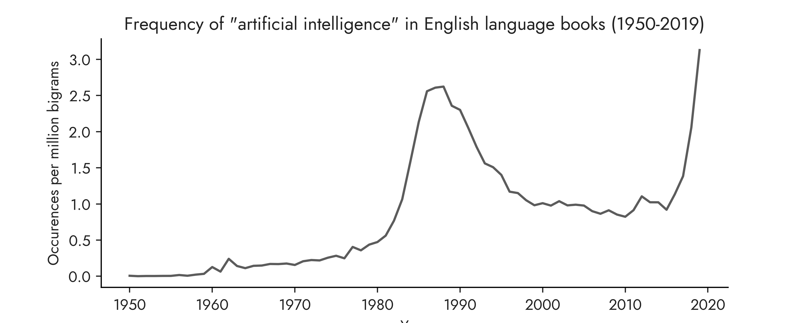

# Artitificial Intelligence Ngrams

This is a chart of the yearly frequency of the [bigram](https://en.wikipedia.org/wiki/Bigram) "artificial intelligence" (case-insensitive) in all english-language books in Google's "English 2019" (`eng_2019`) corpus from 1950 to 2019, according to the Google Books Ngram Viewer. More information about the data source and the corpus can be found [here](https://books.google.com/ngrams/info). Google describes the corpus as "books predominantly in the English language published in any country".

The original chart and data can be viewed [here](https://books.google.com/ngrams/graph?content=artificial+intelligence&year_start=1950&year_end=2019&corpus=en-2019&smoothing=0).

They y-axis of the chart shows: of all the bigrams contained in the "English 2019" corpus in a given year, what proportion of these bigrams are the bigram "artificial intelligence". Note that the y-axis of the plurality version of the plot has been rescaled and relabeled for readibility relative to what is displayed by Google online.

This chart is referenced in the "Introduction" section of the plurality book in two locations; the plot suggests that the term "artificial intelligence" had a surge in popularity/prevalence in the 1980s prior to its resurgence more recently.

Note that the raw data for this chart is downloaded and extracted from Google Ngram viewer page source in `ai_ngrams.ipynb`, as suggested [here](https://stackoverflow.com/questions/7714311/save-google-ngram-result-as-csv).
