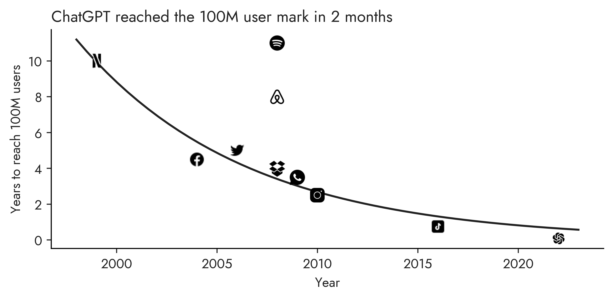

# ChatGPT Adoption

ChatGPT reached the 100M user mark in 2 months - faster than previous online service. The figure shows the quickening adoption rates of the most viral online services.

The original figure takes data from Netscribes and plots it in on a consistent X axis (Year) and Y axis (months to 100M users).

Source: [Netscribes](https://www.netscribes.com/chatgpt-4-a-near-to-perfect-ai-powered-digital-assistant/)
Logos: [Icons8](https://icons8.com/)