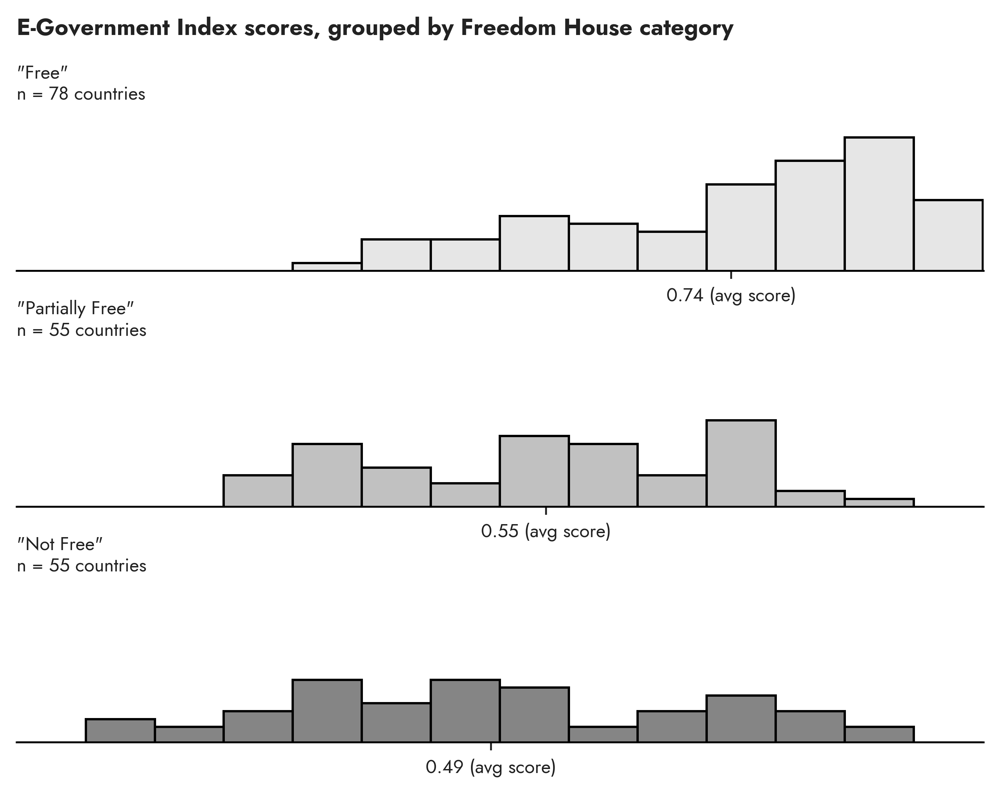
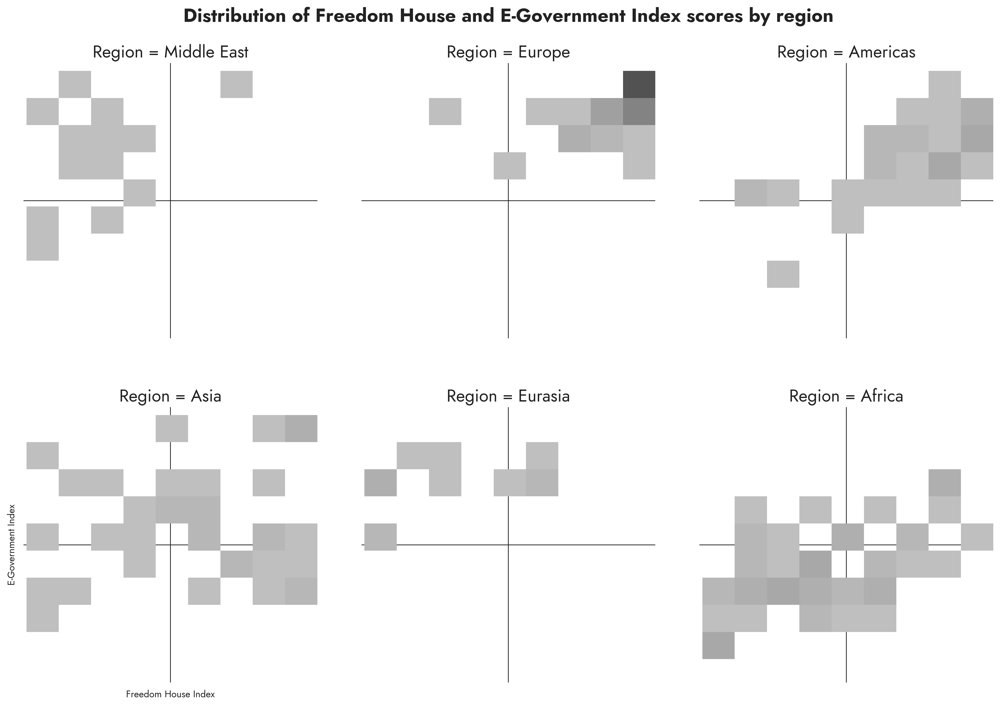

# e-government scores by country

Sources:
- [UN E-Government Knowledgebase](https://publicadministration.un.org/egovkb/Data-Center)
- [Freedom House](https://freedomhouse.org/report/freedom-world)

The data represents the e-government development index (EGDI) for countries around the world.

> The E-Government Development Index presents the state of E-Government Development of the United Nations Member States. Along with an assessment of the website development patterns in a country, the E-Government Development index incorporates the access characteristics, such as the infrastructure and educational levels, to reflect how a country is using information technologies to promote access and inclusion of its people. The EGDI is a composite measure of three important dimensions of e-government, namely: provision of online services, telecommunication connectivity and human capacity.

We join the data set on the Freedom House index, which measures the level of freedom in a country, using the same year (2022).

> The Freedom in the World report is composed of numerical ratings and supporting descriptive texts for 195 countries and 15 territories. External analysts assess 210 countries and territories, using a combination of on-the-ground research, consultations with local contacts, and information from news articles, nongovernmental organizations, governments, and a variety of other sources. Expert advisers and regional specialists then vet the analysts’ conclusions. The final product represents the consensus of the analysts, advisers, and Freedom House staff.