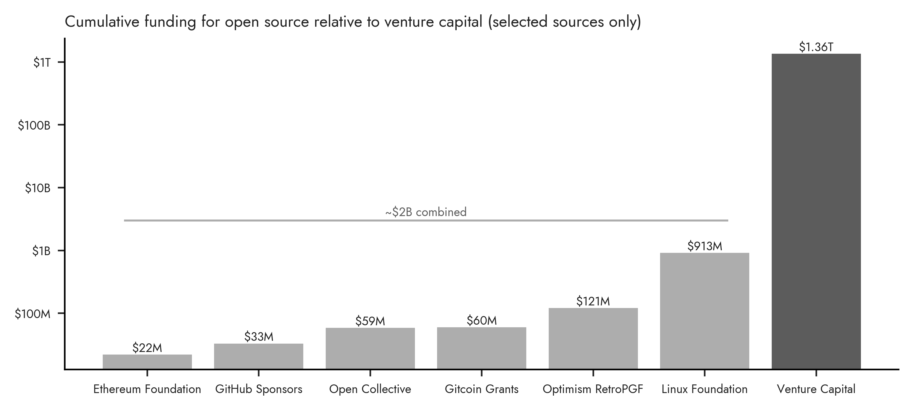

# OSS Funding

This figure shows a survey of open source software (OSS) funding sources. It is not complete, but it does provide a snapshot of the landscape and some of the major players. Where possible, we have included the cumulative funding as of March 2024.

OSS Funding Sources:
- [GitHub Sponsors: Cumulative, as of March 2023](https://github.blog/2023-04-04-whats-new-with-github-sponsors)
- [Gitcoin: Cumulative, as of March 2024](https://impact.gitcoin.co/)
- [Ethereum Foundation](https://practicalpluralism.github.io/); see also [here](https://blog.ethereum.org/2023/06/15/allocation-update-q1-23) and [here](https://blog.ethereum.org/2023/08/15/allocation-update-q2-23) 
- [Open Collective: Cumulative, as of March 2024](https://blog.opencollective.com/fiscal-sponsors-we-need-you/)
- [Optimism RetroPGF: Rounds 1-3](https://community.optimism.io/docs/governance/retropgf-3/)
- [Linux Foundation: Revenues 2011-2022](https://projects.propublica.org/nonprofits/organizations/460503801)

The VC funding data is from the same source as quoted elsewhere in the book in order to be consistent:
- [NVCA](https://nvca.org/pitchbook-nvca-venture-monitor/)
- [Raw data](https://nvca.org/wp-content/uploads/2024/01/Q4_2023_PitchBook-NVCA_Venture_Monitor_Summary_XLS.xlsx)