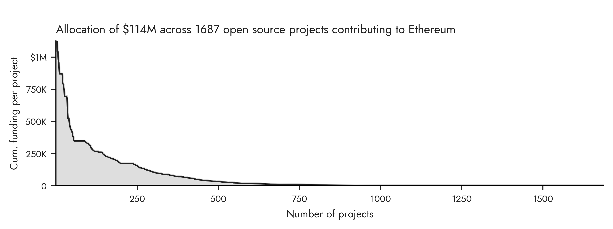
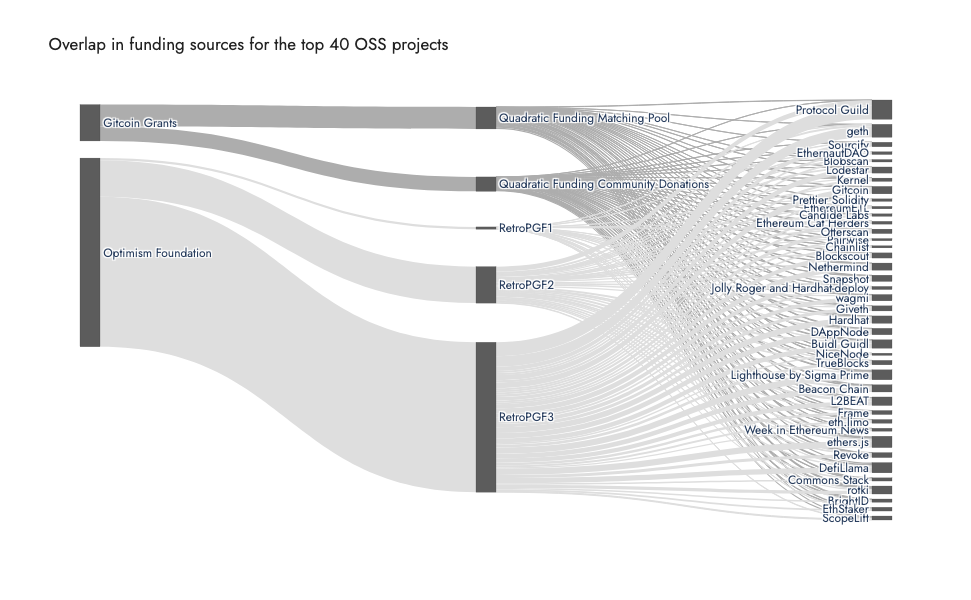

# OSS Funding by Gitcoin and Optimism

These two figures look at the combined funding of open source projects by Gitcoin and Optimism (two major funding sources for projects int in the Ethereum ecosystem). The top figure shows the distribution of funding across all 1687 OSS projects included in the data, which includes a longtail of projects that have received a relatively small amount of funding,

The bottom figure shows the distribution of funding across the top 40 projects as a Sankey diagram. As can be seen from the diagram, there is a high amount of overlap between the two funding sources, with most projects receiving significant funding from both Gitcoin and Optimism.

Gitcoin Grants data is from rounds 1-20, and Optimism data is from rounds 1-3.

Source: [Open Source Observer](https://github.com/opensource-observer/oss-funding)