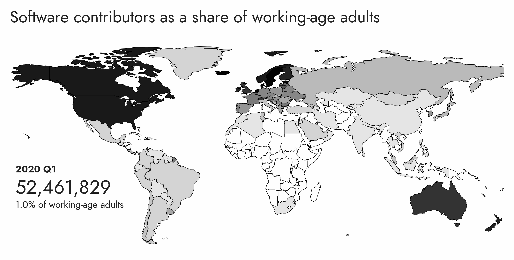

# OSS Impact

This figure looks at the global share of software contributors (developers) as a proportion of the adult population. The data is available quarterly from 2020 to 2023 (Q3). The developer data is from GitHub's Innovation Graph, which is a dataset of developer activity on GitHub. Unfortunately, we don't have an equivalent dataset for other platforms, so this figure is limited to GitHub. We join the data on the UN's adult population data to calculate the proportion of developers in the adult population.

Definitions:

- **Developers**: the number of developer accounts located in a given economy based on mode daily location. This count excludes users that are bots or otherwise flagged as “spammy” within internal systems. See our documentation for personal accounts for more information.

- **Population ages 15-64, total**: World Bank staff estimates using the World Bank's total population and age/sex distributions of the United Nations Population Division's World Population Prospects: 2022 Revision.

Sources:
- [GitHub Innovation Graph | Developers](https://github.com/github/innovationgraph/)
- [World Bank | Adult Population](https://data.worldbank.org/indicator/SP.POP.1564.TO)
- [Taiwan's Adult Population](https://github.com/pluralitybook/plurality/files/14631214/Interior.Stats.Report.xls)