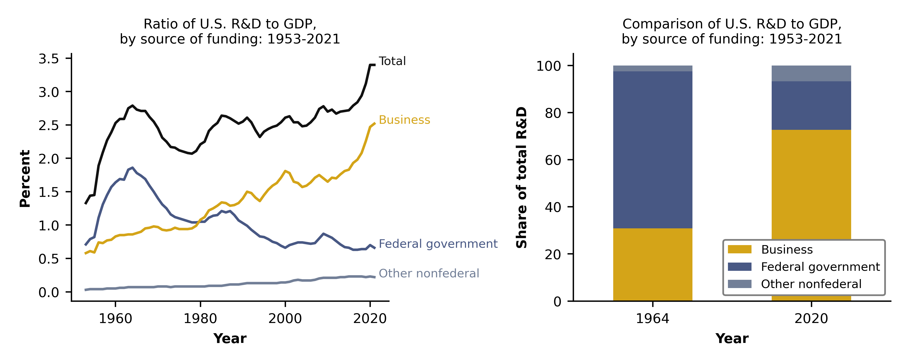
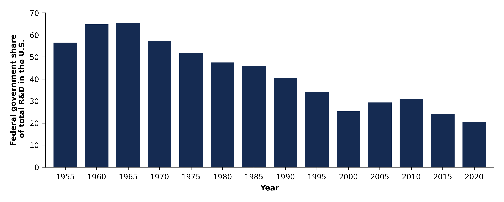

# Federally Funded R&D Declines as a Share of GDP and Total R&D

Source: Anderson G, Moris F; National Center for Science and Engineering Statistics (NCSES). 2023. Federally Funded R&D Declines as a Share of GDP and Total R&D. NSF 23-339. Alexandria, VA: National Science Foundation. Available at https://ncses.nsf.gov/pubs/nsf23339/.

The ratio of U.S. research and development (R&D) to gross domestic product (GDP), at 3.40% in 2021, exceeded 3% for the first time in 2019. However, the decades between the previous peak, 1964, and recent years have witnessed notable changes in the funding sources for domestic R&D. In 1964, federal R&D expenditures accounted for 1.86% of GDP and 67% of all domestic R&D. At that time, business funding for R&D accounted for just 0.86% of the overall economy and 31% of R&D. By 2020, U.S. businesses accounted for 73% of domestic R&D, which amounted to 2.47% of the value of domestically produced goods and services. In the same period, the federally funded shares of R&D had fallen to 21% of domestic R&D and 0.70% of U.S. GDP.

Original article and dataset are available [here](https://ncses.nsf.gov/pubs/nsf23339/)

A simplified version of the decline in federal funding as a share of total R&D is also shown in the figure below.

