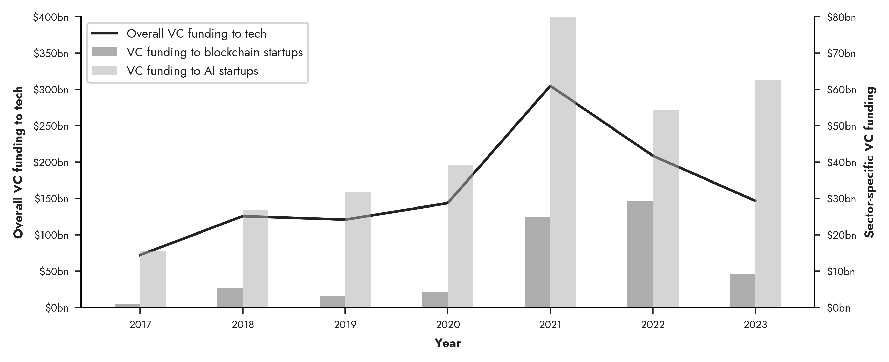

# VC Deals: AI and Blockchain vs Other Tech

Sources:
- [NVCA](https://nvca.org/pitchbook-nvca-venture-monitor/) and [data](https://nvca.org/wp-content/uploads/2024/01/Q4_2023_PitchBook-NVCA_Venture_Monitor_Summary_XLS.xlsx)
- [Pitchbook](https://pitchbook.com/news/reports/q4-2023-crypto-report)
- [Galaxy Digital Research](https://www.galaxy.com/research/insights/2021-crypto-vcs-biggest-year-ever/)

The data represents annual VC funding from the US for AI and other tech, and (global) VC funding for blockchain and crypto. No data is available prior to 2017 from these sources for AI/ML or blockchain/crypto.