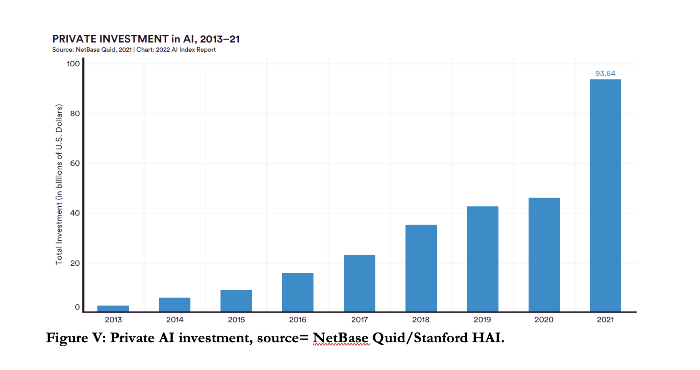
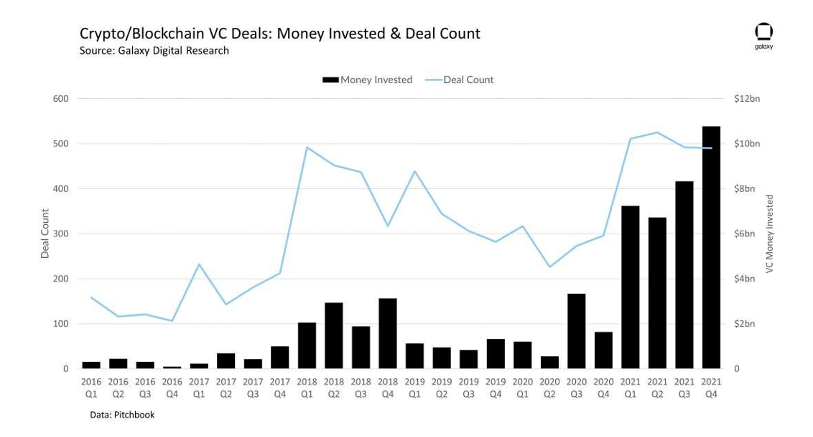
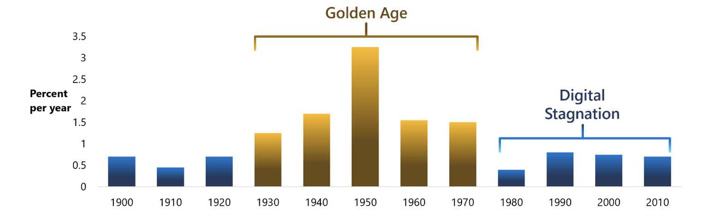
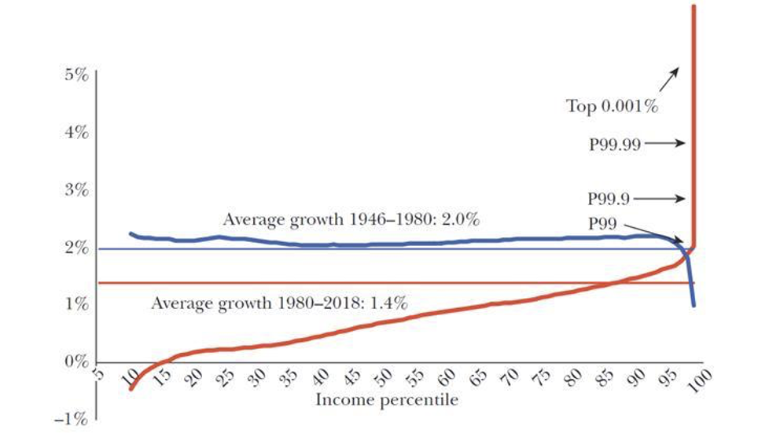
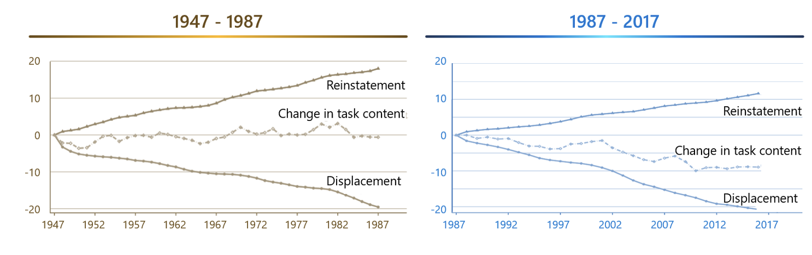

# 資訊技術與民主：日益擴大的鴻溝

原文：Information Technology and Democracy: a Widening Gulf 

| 作者：Audrey Tang, E. Glen Weyl and the Plurality Community
| 譯者：唐鳳Audrey Tang, 周宜蔓Gisele Chou, 王嘉田Greg Wang

---

* 「西方的科技冠軍，美國，已經轉向自我鞭撻——兩大政黨與其民選代表正忙於用一切可能的手段破壞美國的科技產業。」 ——馬克·安德里森，2021年接受諾亞·史密斯訪問時內容。
* 「技術可以是一種民主的動力，然而事實揭示，它也可以是一種對民主的威脅。」 ——肖莎娜·祖博夫，《監控資本主義時代》，撰於2018年。*

---

今天，對於科技和地緣政治的焦慮無處不在。然而，正在進行的一場更為根本性的衝突，相比於強國間爭奪技術霸權的爭端影響更為深遠。深入地觀察，會看見科技和民主發展的道路正在漸行漸遠，日益增大的鴻溝將使它們走向對立，由此引發的爭鬥讓雙方都蒙受損失。

數十年來，科技的主導趨勢，是AI人工智慧與區塊鏈。AI賦予了至上而下的集中控制權，區塊鏈極速化了兩極對立與金融資本主義。二者的結果都侵蝕了民主多元化的價值觀。因此，技術被視爲對民主最大的威脅、或作爲那些外部專制主義者和想從內部顛覆民主者所持的有力工具，也就不足為奇了。

曾經，民主是一場激進實驗，它將單個城邦治理擴大且遍及許多大陸，打敗了封建制度讓數百萬公民參與。時至今日，在這個世界中大部分地區卻將民主視爲：維護僵化、過時、兩極化、停滯，日益非法的政府，在絕望中持續努力的同義詞。

這也是爲什麼，我們不需要對那些現代技術專家蔑視民主、視它為進步的障礙，和那些民主擁護人士憂心科技進步會帶來專制的主導或內部崩潰的種種態度感到訝異。在這本書中，我們一同向讀者表述這種悲劇性衝突是可以避免的，正確構想的科技和民主兩者正是彼此強大而自然的盟友。

儘管這些言論在某些時後確實會引來些輕蔑目光，其來有自 ; 在過去十年裏，兩派之間的分歧發展，衝突怨恨與不信任的鴻溝早已深結。這些並不容易被輕易化解，卻也並非不可能。只有充分承認二者的存在價值、接受這場衝突中來自雙方的合理關切和批評，我們才有機會看清楚根本的差異性，繼而尋求如何超越這些差異。 所以，讓我們率先以慷慨的精神提出這些不滿，接受引起廣泛關注的批評，即使現有的證據並不完全支持這些批評。 讓我們試圖調和這些極端衝突框架，進而開創一個提升民主技術雄心的機會。

## 技術對民主的威脅

過去十年的資訊技術以兩種相關，同時又相反的方式威脅著民主。正如達倫·阿西莫格魯(Daron Acemoglu)和詹姆斯·羅賓森(James Robinson)提出的著名論點：「自由民主社會」存在於社會崩潰和專制主義之間的「狹窄的長廊」中 [^1]。從這兩方面來看，資訊科技正在不斷地縮小長廊，擠壓自由社會的可能性。

一方面來看，技術（例如，社群媒體、加密技術和其他金融科技）正在打破社會結構，加劇兩極分化，侵蝕傳統規範，破壞執法力度 ; 在技術的助力下，金融商業得以快速擴張了它們的領地範疇，這也導致了它們對民主政體不負責任。 我們將這些威脅稱為「反社會」。 另一方面，技術（例如，機器學習、基礎模型、物聯網）的發展正在加強集中監視的能力，透過一小群工程師操控系統的能力，就可以塑造數十億公民和顧客的社會生活的系統模式，限縮了人們有意義參與生活和社區發展的範圍。我們稱這樣的威脅為「集中化」。

這兩種威脅都打擊了民主的核心，正如阿列克謝·德·托克維爾 (Alexei de Tocqueville) 在《美國的民主》(Democracy in America) 中著名強調的那樣，民主依賴於深刻且多樣性，非市場性且分散式的社會與公民關係方可蓬勃發展[^2]。

讓我們先從觀察開始，觀察這些來自最新技術的反社會威脅在：社會、經濟、法律、政治與存在方面的面貌。

## 社會方面:

越來越多的可信資料指出，社交平台的出現為那些往昔曾在社會中被孤立的人（比如，在保守地區的性少數群體）做爲一個強大的工具來建立聯繫，但放大到整體平均來看，這些平台卻反而重重加深了社會孤立和排斥感[^3]。

## 經濟方面:
 
網際網路和越來越流行的遠距辦公模式，在地理、時間和僱傭制度上都加上了巧妙靈活的網際網路特性，更替發展中國家的工作者、或部分不適合傳統勞僱市場的人擴大了機會。 不過，當新模式出現時，在廣泛的觀察後得出：現行的發展機制並沒有做好完全的準備，可支持的機構與制度條件也沒有隨之出現（如：工會與勞動法規等）。如此看來，雖然一方面可以共享創新模式中的潛在利益，另一方面卻也提高了工作場所與機會的不穩定性和風險，亦導致了許多已開發國家的中產階級「空心化」[^4]。

## 政治方面:

兩極分化和極端主義政黨的影響力在許多先進民主國家中正逐步上升。儘管，對於網路社交平台在社會中扮演的角色，其在學術界早已經是重要不過的辯論與研究議題，然而在最近的調查報告中表述了這些平台、工具遠遠未實現它們當初所承諾的，例如：幫助跨越差異分化的社會和政治紐帶關係，反過來還很可能促成了自 2000 年以來兩極分化的長期上升，尤其是在美國[^5]。

## 法律方面:

過去幾十年來在金融創新的高速發展下，實際消費者的利益卻未必增加（減少風險、資本分配或信貸方面）; 相反的，它反而替金融體系帶來了更大的治理挑戰。當金融服務激增，甚至還繞過了旨在緩解這些潛在傷害的現行監管制度[^6]。例如，正因為我們對於房地產金融創新的不理解，2008年金融危機來臨前，圍繞著住房融資的創新是一些最具影響力的例子。但最極端（如果更有監督力）的案例也許是最近圍繞數位 "加密 "資產和貨幣的發生。鑑於它們與現有監管制度的不匹配，它們為投機、賭博、欺詐、監管和逃稅以及其他反社會活動提供了普遍的機會[^7]。

## 社會認知和群體行動能力的碎片化，將是極其危險的:

導致人們愈來愈擔憂生存問題——該如何面對越來越先進的大規模毀滅性技術，從環境破壞（比如，氣候變化、生物多樣性喪失、海洋酸化），到更直接的武器發展（比如，錯位的人工智慧與生物武器等）[^8]。即使科技被認為正在破壞民主社會的凝聚力，也越來越被認同在如果爲了加強政府的控制而將權力集中在一小部分私定決策者手中，對民主同樣構成威脅。

在社會上，資訊技術最一致的影響也許是擴大資料範疇和加速這些資訊的傳播。不過這些行動也擴張到了民眾生活與私領域範疇，越來越多的資料可被公開取得。當然，在於透明度的原則將可能引發一系列社會效應與公眾討論，然而事實上，處理和分析這些資料可用價值的權力確實早已落入資本的手中，這些企業有獲取資訊內容的特權、也有投資於大規模統計模型（即「人工智慧」）的資本，而這些資料價值還可以再被繼續應用。

這些模型在獲得更多的訓練資料和資本支持下可以得到極大的改善加值，在一些可以被行為價值受益的數據池範疇，往往被認可它們在「人工智慧競賽」中領先，這也給所有的社會都帶來壓力，允許在這般資訊力量的集中狀態下競爭[^9]。種種因素相加，更迫使社會為了競爭的需要，接受這樣的資訊權力集中，也甚至走向監控，造就了前所未有的現象： **監控和對資訊的控制成為常態。**

在法律方面，AI 最新的發展速度和變革能力，衝擊了許多民主社會的核心權利，而掌控這些至關重要選擇的關鍵權力，卻由少數背景相似的工程師把持。可以看到，大型AI模型在「重新混製」內容的能力可以在很大程度上迴避了智慧財產權法律和其他創意活動保護措施，現行的隱私制度也不一定可以跟上資訊爆炸式擴散發展。反歧視法在處理黑箱AI系統與隨之出現的潛在新興偏見和引導作用等方面，並非如此合適。另一方面，有可能解決這些問題的工程師，往往都在替追求利潤的公司或國防部門工作，他們的教育和人口背景特定且高度一致（通常是白人或亞洲人、男性、持無神論、受高等教育等等），這也對民主法律制度的核心原則提出挑戰，因為這些原旨在它所代表的廣大社會的意向。[^10]。

經濟方面，越來越多的調查顯示，AI以及自20世紀80年代中期以來資訊技術的更廣泛趨勢即：取代而非補充人力勞動（特別指教育程度低的族群），這已成為過去幾十年來資本（非勞動）所得份額劇增的核心因素，從而導致了先進國家的收入不平等加劇[^11]。伴隨著勞動份額的下降，市場力量、利潤率和產業集中度（不那麼一致地）在全球各地的攀升，特別出現於那些最依賴資訊技術的國家和行業[^12]。

## 在政治和地緣方面:

上述因素都加強了專制政體和政治運動對民主國家的掌控。大規模監控、AI和其他大規模資訊處理機制創造的工具平台與激勵手段，也讓它們更容易的直接進行審查制度和社會控制，還更加輕鬆。逐漸的透過將經濟力量和社會控制的槓桿集中於一小部分咽喉卡點（通常是企業）的巧妙手法，資本收入的增加、市場力量的增加以及小型工程師群體日益增長的權力，使得這些威權主義政體更容易在需要時操縱或奪取經濟和社會的制高點[^13]。

再者，這兩種威脅相互交錯；專制政體越來越善於利用社交媒體和加密貨幣的「混亂」在民主國家撒下種子製造分裂和衝突。集中化社交平台利用AI，極大化用戶對服務的熱度，往往造就了爭議資訊和意見分群，導致離心傾向。然而，即使在這兩種威脅並未積極互補、且意識形態在多方面互相衝突的情況下，也都對民主社會施加了壓力，並破壞了對民主的信心。這種不信任的發展，讓現在許多先進民主世界中的信任調查，已經降至有記錄以來的最低點。

# 民主國家對技術的敵意

這種敵意遠非單向的。整體來說，民主國家已經回報了這種敵意，他們越來越把技術視爲一種整體的威脅，而不是曾經看到的機會。民主國家的公共部門曾經作爲資訊技術發展的全球推動力（例如：第一台電腦、網際網路、全球定位衛星），時至今日，大多數民主國家的政府卻轉向限制資訊技術的發展，更無法對資訊技術創造的關鍵發展和挑戰做出有力的回應。

這種衰退的表現在四個方面：

1. 首先，民主國家的公眾輿論與政策制定者對大型科技公司甚至許多技術專家懷著敵意，這種趨勢通常被稱為： **「科技反感（techlash）」。**
2. 民主國家已大幅減少對資訊技術發展的直接投資。
3. 民主國家在公共部門的應用或需要大幅度公共部門參與的資訊技術進程相對遲緩。
4. 最後，與此相關的是：針對現今科技專家公認，需要透過公眾參與、監管、支持方能保障技術永續發展的關鍵領域，民主政府在很大程度上束手無策，反而側重於根深柢固的社會和政治問題[^14]。

2010 年代左右，社會和政策制定者對技術的態度出現了明顯的負面變化。在 2000 年末和 2010 年初，社群媒體和網際網路曾被作為為開放和參與的力量持續了將近 10 年，但在 2010 年末，它們開始被社會輿論撻伐，並在某些公眾意見調查中被歸咎爲上述許多弊端的成因[^15]。如此態度的轉變也許在精英態度上看的最清楚，關於技術的暢銷書，如凱西·奧尼爾（Cathy O'Neil）的《大數據的傲慢與偏見》和肖莎娜·祖博夫（Shoshanna Zuboff）的《監控資本主義時代》，以及《智能社會：進退兩難》等電影，這些都左右了公眾輿論與各階層的政治領導人（例如，左派的傑里米·科爾賓（Jeremy Corbyn）和右派的喬什·霍利（Josh Hawley）對科技行業採取了愈趨悲觀和激進的基調）。

**「科技反感（techlash）」** 的興起正擴寫了這些擔憂的存在`（圖示，可能使用了谷歌NGRAMS的語言）`。而 **「取消文化（cancel culture）」** 的興起，則進一步強化了它，透過利用社群媒體、社交平台攻擊或降低知名人士的文化價值，且特別針對科技行業的領袖人士，其時常被作為主要攻擊目標。

在歐洲和美國的監管機構已經採取了一系列行動，包括：大幅增加對領先技術公司的反壟斷審查、歐盟的一系列監管措施，如《一般資料保護規則》(General Data Protection Regulation,GDPR)以及《資料治理法案》(Data Governance Act）、《數位市場法案》(Digital Markets Act )和《數位服務法案》(Digital Services Act)）。這些行動都有著清晰明確的政策依據，未來很可能被採用爲積極技術議程的一部分。

然而，消極語氣、和自然相關技術發展的相對脫勾，並且這些民主進步國家中的評論員和政策制定者對於如何闡述一個積極的技術願景的普遍沉默，種種因素相加下，反而構築了一個行業被圍困的形象。 或許最顯著反映出公共部門對資訊技術關注下降的量化標記，就是公共「研發」（R&D）支出佔國內生產總值（GDP）的比例下降，特別在於資訊技術的範疇。而這也反映出在大多數的民主進步國家中，即使企業的研發R&D支出不斷增大，圍繞在公共相關的 R&D 佔 GDP 的比例卻在近幾十年呈現出下降趨勢。
> 不過在此處，中国政府的R&D支出佔GDP的比例卻大幅增加，更以資訊技術領域為重點（需要圖示）[^16]。

除了這個量化的故事外，公共部門在 **“支持”資訊技術發展上的衰退表現的同樣戲劇性** 。公共部門曾引領了網際網路的出現（美國）、個人電腦的基礎和其他類似項目於民主國家的發展（例如法國的Minitel），過去的它扮演了至關重要且帶頭推動的角色，今時今日，有關資訊技術發展上的重要突破卻幾乎都是由私部門來推動的[^17]。

儘管最初的網際網路幾乎完全是由公共部門和學術界開發且基於開放標準，但Web 2.0以及近期圍繞“web 3”和分散式社交技術的運動卻幾乎都未得到公共角度的支持，因為民主國家的政府仍在埋頭努力評估數位貨幣、支付和身份系統方面的可行性 ; 儘管計算機的最基礎進步是在二戰和冷戰期間由民主國家的政府取得的，但今日，政府在“基礎模型”這些顛覆性的計算機科學突破中，幾乎完全沒有發揮作用。

事實上，OpenAI創始人Sam Altman和Elon Musk都曾表示，他們最初是向公共資金尋求支持的，不過由於屢次被拒絕，最終才轉向尋求資本盈利導向的支持資金；OpenAI後提出了生成式預訓練模型（Generative pre-trained transformers; GPT），這也使得公眾可以對 AI 的潛力產生了越來越多的想像[^18]。再一次，這與那些專制政權，如中国大陆，形成了巨大反差，後者制定公共資訊技術戰略，積極部署還雄心勃勃的推動它。[^19]。公共部門看待科技的重要性並不僅限於研究和開發，還涉及部署、應用和促進便利化。在這方面最容易被衡量的領域正是數位上網和教育的質量與實用性。

> 在這方面的數據有些複雜，因為許多高效運作的民主國家（比如斯堪地那維亞國家等）擁有既品質高也可用性高的網際網路。但值得注意的是，領先的專制政權在最新連接技術方面的表現遠超越同等發展水平的民主國家，尤其是中国大陆和沙特阿拉伯等國家。例如，根據Speedtest.net的數據，中国大陆在全球國家網際網路速度排名中位居第16位，而人均收入排名第72位；沙特阿拉伯和其他海灣君主制國家在這方面表現也同樣出色[^20]。在5G此一新一代移動連接技術方面，表現更為突出：一系列調查顯示，中国和沙烏地阿拉伯在5G覆蓋最佳國家排名中始終位列前10名，遠高於其收入水平。

而對於民主國家政府的核心責任而言，更重要的是在於 **公共服務的數位化** 。
> 聯合國在其數位政府發展指數中有一些相關的數據顯示它支持了這一個論述，但我們仍需要更多數據和分析來進一步瞭解。

關於傳統公共服務的數位化，或許是人們覺得民主政府最理所當然可以善用技術之處。在這些新興領域，技術已經重新定義了哪些服務才能滿足現今的使用習慣，但民主國家卻完全無法跟上時代的步伐。——過去，政府提供的郵政服務和公共圖書館是民主交流和知識傳播的重要支柱，而現在，大部分的溝通與資訊傳播都是透社群媒體和網路搜尋進行的。曾經大多數的公共聚會都是在公園和“真的”公共廣場上進行，現在「公共廣場已經轉向線上」早已是老生常談了。

民主國家幾乎無視於支持數位公共服務的重要性。私有化的Twitter雖然早被公眾人物不斷濫用，但它最明顯的競爭對手- 非營利的 Mastodon 和它所基於的開放標準 Activity Pub，卻僅僅獲得了幾萬美元的公眾支持，它的營運資金主要仰賴於 Patreon平台上的捐款。更概括的說，開源軟體和維基百科這些具有公地性的公共產品，已然成為數位浪潮時代下至關重要的公共資源；然而卻未見各國政府支持它們，實際上它們受到的支持甚至也無法與其他慈善組織相提並論。（比如，提供開源軟體的事業，通常不能成為享有免稅的慈善機構）。與此同時，專制政體正在積極推進中央銀行數位貨幣計劃，而大多數民主政府卻才剛剛開始...。 **"積極大膽的想法是，民主國家可以像那些專制國家一樣，推動以技術重塑社會結構的激進實驗。""** 但在這方面，民主制度似乎更常成為阻礙，而不是促進這些實驗的發生。”

中国已經建設了城市，例如深圳，提供環境來促進無人車發展，更進一步廣泛制定了國家科技策略在政策、法規和投資方面全面取得進展[^21]。沙烏地阿拉伯正忙於在沙漠中建立一個新的智慧城市 Neom，展示一系列綠色和智慧城市科技 ; 反觀在民主國家，即使是溫和的地區專案，如Google"Sidewalk Labs"，卻也被當地的反對者淹沒了。 

即使在一些技術專家認爲需要被監管或謹慎以待的領域，民主國家也越來越落後在產業虛切，也無法找到這些新興社會挑戰需要的解決方案。這些技術專家越來越明確的共識是：一系列新興技術或可能帶來災難性，甚至是所謂的生存風險，在這些開始後將難以防範。

比如，人工智慧系統可能會迅速升高自身能力，而加密貨幣可能造成系統性金融風險和高傳染性生物武器的研發。這些人的擔心主要在於民主國家的政府可能根本無法想像，更別說如何制定應對這些風險的計畫與配套措施。不過，除了這些糟糕透頂的可能性外，各式各樣的新興技術，也都需要監管機制變革才能可持續的發展。勞動法無法符合資訊技術賦予下地理和時間靈活的新型態工作模式、版權法對於大型 AI 模型中數據輸入的價值歸屬判斷顯的有些不合時宜、區塊鏈正為新形態的公司治理賦能，而證券法通常很難理解這些形態，並且經常將其置於法律危險之中。

即便對公共部門來說，嶄新願景的大膽實驗已在專制國家中十分常見，但民主本身還有一個更為根本的要素，卻落後於時代最遠，即：公眾同意、參與和合法化的機制，包括投票 、請願與徵求公民反饋等，甚至可能比民主社會的任何方面都更加守舊。在近乎全體的民主國家中，多數重要職位每隔幾年就需要投票選舉，其規則和技術在過去的一個世紀裡幾乎沒有發生過任何變化。儘管公民如今可以在全球範圍下無國界地即時交流，所謂的民意代表，還是從固定的地理選區產生，以低保真、高成本的方式進行。現代通訊和數據分析工具，鮮少成為公民民主生活的常規成分。

與此同時，專制政權越卻來越頻繁地使用新穎的數位創新機制來強化監控力道（無論好壞）和社會控制。例如，中国大陆政府廣泛使用臉部識別技術來監控人口流動，採用數位人民幣和其他可受監控的數位支付工具（同時也打擊更隱密的替代品）種種來進行金融監控，甚而開發了一個全面的「社會信用評分制度」系統，該系統將追蹤大範圍的公民活動，並將其梳整為一個具有影響力的「評級」[^22]。`（需補充更多相關案例）`**——"某種意義上來看，民主正被技術拋在後面，這正是因為民主對技術的忽視和技術本身的反民主傾向，二者漸行漸遠。""**

# 你得到你所付出的

**我們是怎麼走到這一步的？這些衝突是科技和民主社會的自然航道嗎？是否有不同的未來可能？**

一系列的研究已經揭示，科技與民主的發展可以是齊頭並進、共融演化的。我們目前走的路徑，只是通過政策、意見、期盼和文化所做出的集體選擇結果。從科幻作品到現實世界中的案例，提供了多元視角，讓我們一窺各式各樣的可能性。

比如說，科幻作品讓我們遇見人類思維所能想像的驚人未來。在很多情況下，這些故事裡的想像靈感，往往正是研究員和創業者開發新科技的技術基礎成因。尼爾·斯蒂芬森在 1992 年的科幻小說《潰雪（Snow Crash）》中，描繪了一個未來世界，人們大部分時間都在虛擬沉浸式世界「元宇宙」中度過，這樣的過程削弱了真實世界中的社區和政府的必要參與，黑手黨和邪教領袖乘虛而入，發展出大規模的毀滅性武器。

在這個未來與我們在上文討論的民主與科技之間的「反社會」威脅的元素密切相關，斯蒂芬森的其他作品進一步延伸了這些可能性，對科技發展產生了深遠的影響；例如，Meta的平台就是以尼爾·斯蒂芬森（Neal Stephenson）的元宇宙命名的。對於科技藉由創造「超級智能」可能會導致權力集中的趨勢，也有類似的例子。著名的例子包括艾薩克·阿西莫夫和伊恩·班克斯的小說、雷·克茲魏爾的預測未來主義（Predictive Futurism），以及《魔鬼終結者》（Terminator）和《她》（Her）等電影。

不過，這些可能性彼此都截然不同，也不是從科幻小說中可找到的技術未來的唯一願景。事實告訴我們，在一些最著名的科幻作品中已展示了非常不同的可能性，《傑森一家》和《星艦迷航記》——這兩部有史以來最受歡迎的科幻電視劇，二者分別描寫了非常不一樣的未來輪廓。前者展現了科技如何強化了 1950 年代美國的文化和制度 ; 後者則展示了科技如何推動一個後資本主義世界走向多元交織的異星交融的智慧樣貌。而這些，也僅只是成千上萬個想像中的其中兩個。科幻作家娥蘇拉·勒瑰恩和奧克塔維亞·巴特勒也創造了各自獨特的未來世界，如娥蘇拉·勒瑰恩（Ursula LeGuin）的後性別、後國家想像，到奧克塔維婭·E·巴特勒（Octavia Butler）的後殖民的未來。這些作品都表明，科技和社會的共融演化的可能性[^23]。

科幻作家並不孤單。在科學與技術研究領域（STS）包括哲學、社會學和科學史的重點主題，一直都是科技發展中固有的偶然性和可能性，其演化過程中並沒有單一必要的發展方向[^24]。

這樣的論述在社會科學領域(比如：政治科學和經濟學)越來越被普遍接受。這些領域在傳統上，將科技進步視為：既定和給予的。

世界領先的兩位經濟學家，達倫·阿西莫格魯（Daron Acemoglu）和西蒙·約翰遜（Simon Johnson），最近出版了一本書，主張技術發展的方向是社會政策和改革的關鍵目標，並揭示我們過去所經歷的技術發展其實是充滿了偶然性。[^25](/6jsPSVcITYWxwJqDODqspQ)。而或許最引人注目的例證，正是來自於對比現在各國技術發展的趨向。曾經有一位前瞻思想家預言了技術的力量將可以消彌社會差異，如今，從大國家到小國家的技術系統定義了它們相互競爭的社會制度，這與它們陳述的意識形態一樣重要：中国大陆的監控制度看起來像是一種技術未來，而 俄羅斯的駭客網絡似乎又是另一個未來，由 web3 驅動的社群空間是第三種，我們關注的主流西方資本主義國家則是第四個， 印度、愛沙尼亞和台灣等多元異質的數位民主國家，則有完全不同的發展。——我們將在下文中深入探討。這些發展都不那麼趨向一致性，甚至可以說，技術正在不斷擴大未來的可能性。

那麼，如果我們當前的科技軌跡和社會關係在西方自由民主世界**並非必然的走向，那為什麼我們會選擇走上這條衝突之路?又有什麼辦法可以避免這種情況呢？**

儘管有很多方法可以描述民主社會對技術所做的選擇，但最具體、最容易量化的可能是實際投資的程度。這些投資清楚地顯示出西方自由民主國家（以及世界上的大部分金融資本）對未來技術投資所做的技術路徑的明確選擇，其中許多都源自於近期。雖然這些行動看起來主要由私部門推動，但它們也反映了早期政府設定的優先順序，這些過去的抉擇在許多面向都才剛剛開始滲透也影響私部門的應用。

從近年越來越受到關切的創投行業趨勢中來看，過去十年裡，在高科技產域的創投資金已經明顯且大量的集中在 AI 人工智慧和加密貨幣相關的 "web3" 技術上。圖V顯示了由 NetBase Quid 收集的 AI 私人投資數據，有關人工智慧私人投資的數據，並由史丹佛大學人本人工智慧中心的 2022 年 AI 指數報告繪製，顯示了在 2010 年代的爆炸式增長，這種增長已經主導了私人技術投資類型。

> 圖W展示了（在不同時間段和季度）基於 Pitchbook 數據的web3領域的相同情況，由 Galaxy Digital Research 繪製。（我們需要根據整體和以高科技為重點的創投來對這些數據進行比較，並將其放在我們自己生成的一致且單一的圖表中。）儘管這些優先排序發生在近期，並且似乎也是從 "市場" 的邏輯中產生的，但它們反映了一個更長期，且是由群體所產生的一系列選擇結果。這些選擇源自於民主國家政府所決定的投資策略。我們仍然需要挖掘這些數據，腳注中有一些事實揭示，不過我們需要按主題區域的時間序列進行分析[^26]。

這些投資不僅僅原本是可以做出"不同選擇"的選擇，也是相當近期才出現的，在此之前的選擇方式則截然不同。 `（這裡，我們需要再追溯關於私人與創投投資的數據。）`這些投資反映在過去幾十年的標誌性技術發展中。 AI 人工智慧在 1980 年代大部分時間都被預言爲「即將到來的革命」（正如 Google nGrams 追踪的英文書籍中這個詞組的相對頻率所反映的圖表）。然而，1980 年代的里程碑恰恰相反——個人電腦使 " 運算 " 成為個人創意的擴展。1990 年代，史蒂文森的科幻小說想像了逃避虛擬世界和原子化加密的可能性，網際網路將世界連結在一起，開創了前所未有的資訊和合作時代。2000 年代的手機，2010 年代的社群網絡，以及 2020 年代的遠程工作基礎設施......這些都不是專注於加密超資本主義或超級人工智慧的發展。

這些內容都反映出公共部門發展研究路徑的轉變，雖然這部分存有相當大的時間落差且數據並不完美，不過W. Mitchell Waldrop 在他的經典之作《The Dream Machine》中已經清楚的記錄了此一轉變：ARPA高等研究計劃署資助了演變成網際網路的ARPANET高等研究計劃署網路，並且在它更名爲DARPA國防高等研究計劃署（Defense Advanced Research Projects Agency）的同時也改變了投資重心。

> 如此一來，亦大幅降低了對通信韌性和社會系統技術有關的重視，轉頭更直接的支持與軍事目標有關的系統等發展，包括自主武器和加密技術。 1979 年，資助了 ARPANET 和世界上第一個計算機科學的創始 ARPA 項目官員 JCR Licklider 對於公共資金不再支持這些對網路社會的關鍵基礎設施直接表示了懊悔[^27]。此一趨勢在 1980 年代更為明顯，圍繞著軍用國家防禦的關注愈趨狹窄。

# 二十一世紀的意識形態

**如果技術的發展路徑不是預先決定的，相反，它可以透過市場投資所呈現的集體選擇來形塑，那麼我們又該如何思考一個社會在發展方向上的靈活性呢? 選擇的範圍可以多大，這些選擇又會如何表現？**

在思考社會可能選擇的路徑上，一種可用的類比是 **「意識形態」**。 

我們都明白，不同的社會在發展上可能會選擇使用不同意識形態組合它，比如：共產主義、資本主義、民主主義、法西斯主義、神權主義等等。不同的意識形態也有各有利弊，對不同群體也有不同的吸引力，在不同程度保持一定共識達成一致性和制度化。這些不同的意識型態上某些時候也需要特定的歷史和社會條件，不然它們將無法形化。

我們也可以採取如此的方式，來觀察技術的軌跡差異。未來的範疇並非漫無止境或無限可塑：有些事可能更容易，更困難或完全不可能——"重點是，它並不是預先決定的"。 有許多關於未來的合理願景和可以賦予這些願景達成的技術；我們可以通過集體技術投資，來幫助我們在這些可能性中做出選擇。

這樣的觀點，或許與今日常見到的關於技術的線性、進步的敘事都略顯陌生，不過這不是它首次被提出。這樣的觀點，早已被文學、學術研究與娛樂文化採用爲主題，並且經常出現。一個十分引人注目的例子正是電玩《文明帝國》系列，在這款遊戲中，玩家可自行替一個民族量身打造他們從史前到未來的路線圖。遊戲的一個定義性特徵正是「技術路徑的多元樣態」，這些路徑和社會可能採納的社會系統二者之間的交互方式。

這款遊戲系列的最新作品，《文明帝國VI》，特別是其中的「風雲際會」擴展包，非常優雅地說明了上述。在遊戲裡面，「未來時代」有三種意識形態可供選擇： **「合成專家統治（Synthetic Technocracy）」** 、**「法人自由意志主義（Corporate Libertarianism）」** 和 **「數位民主（Digital Democracy）」** ，它們各有各的優缺點和與技術發展的脈絡。乍聽之下，這些名稱似乎顯得有些異想天開，但接下來我們將論述它們何以作為20世紀的共產主義、法西斯主義和民主主義一般，並且在很大程度上描繪出我們現存的這個時代下宏偉技術的意識形態辯論——讓我們將其稱為「二十一世紀的意識形態」。

# 人工智慧與專家統治

第一個，也是最直接的表示出技術未來願景是圍繞著 AI 人工智慧與社會系統將如何相互適應而展開的。這樣的情境被《文明帝國 VI》中的 **「合成專家統治」** 類別所捕捉，我們認為，根據大多數支持者的觀點，將其稱為 **「富饒專家統治（Abundance Technocracy，簡稱 AT）」** 更為一致。

AT  專注於 AI 創造出的未來潛力，正也是 OpenAI 創辦人 Sam Altman 所說的「適用於一切的摩爾定律」。AI 使所有物質商品變得便宜且充足，看起來在原則上解決了物質稀缺的問題。不過，這樣的潛在豐盛可能不會平均分配，它創造的價值將可能只集權於一小群控制和領導 AI 系統的團體手中，也因此 AT 社會願景的一個關鍵元素是：資源再分配，一般來說是通過“無條件基本收入”（UBI）進行。另一個關注重點則是在於 AI 可能會失去控制並且危及人類的生存，因此，需要對這些技術的訪問存取進行強權且通常是集中式的管理，以確保它們能夠"忠實地執行人類的意志"。 `雖然此一觀點的確切輪廓在其支持者間各有表述，但“通用人工智慧”（AGI）的概念是核心：機器在某種通用性能上超越了人類，也讓人類個人或集體認知功能，變得幾乎毫無價值。`

其主要倡導者是在矽谷的Sam Altman，他的導師 Reid Hoffman 與 Elon Musk。這樣的觀點卻在中国十分受到歡迎，馬雲、經濟學者余永定以及中国大陆政府新一代人工智慧發展計劃（基於馬克思主義的“中央計劃”思想）都在推動 AT。 它還出現在科幻小說中，如以撒·艾西莫 (Isaac Asimov) 和伊恩·班克斯 (Iain Banks )等作者的作品中以及雷蒙·庫茲維爾 (Ray Kurzweil) 和尼克·博斯特羅姆 (Nicholas Bostrom) 等未來主義學家的著作。與此觀點一致的組織包括了 OpenAI、DeepMind ，也涉及至一些先進的人工智慧項目。在美國，Andrew Yang 的政治運動也促進如此看法進入主流政治中，AT 觀點在某種程度上也以較為淡化的形式出現在“科技左派”的許多思想中，包括 Ezra Klein、Matthew Yglesias 和 Noah Smith 等評論者。

# 加密貨幣與超資本主義

第二個，其實在主流媒體中並不那麼常見，但在比特幣和其他加密貨幣社群，或相關性網路社群中一直是一個重要且主導性的題目。其可見於《文明帝國VI》的「法人自由意志主義」類別， ES 的支持者往往更偏好使用 **「創業主權」(Entrepreneurial Sovereignty, ES)** 這個標籤，因此我們採用這個名稱。

ES 關注加密技術和網路協議，取代人類團體組織和政治發展角色的潛力（或者，必然性）。使個人能夠參與在沒有政府和其他組織團體「強制」的環境和規範的自由市場。

小說一直是 ES 思想的重要繆思，包括艾茵·蘭德(Ayn Rand)和尼爾·史蒂文森(Neal Stephenson)的作品。史蒂文森的書籍，特別是《潰雪》（1992年）和《Cryptonomicon》（1999年），即使它們鮮明顯要的提出反烏托邦的警示，但早已被 ES 的支持者引用爲藍圖更加以採用。這些作品和隨後成為 ES 社群核心的示範技術包括史蒂文森（Stephenson）稱之為「元宇宙」(Metaverse）的身臨其境虛擬世界、獨立於政府體系外的數位貨幣且不受監管，比如：漂浮城市（floating cities）、海洋據點（sea steads）等概念的私人主權、可迴避集體控制/法律的強大加密技術等。比特幣、web3、4chan和其他 "邊緣" 但有影響力的線上社群一直是 ES 觀點的社會基礎核心。

或許正因為 ES 比 AT 更不主流，它有著更清晰的知識系統和領導者。《The Sovereign Individual (主權個人)》的作者詹姆斯·戴爾·戴維森 (James Dale Davidson)和威廉·里斯-莫格 (William Rees-Mogg) 筆名 Mencius Moldbug的 Curtis Yarvin的著作，以及Balaji Srinavasan的《The Network State (網路國家)》在社群中被廣泛傳閱和引用。風險投資家 Peter Thiel 被普遍認為是 ES 核心思想領袖，還有他資助或推廣的其他作者（如前所述）。

ES 與民主國家的民族主義者和極右翼有著既密切又些許複雜的關係。一方面，許多 ES 的參與者與這些群體有著緊密的連結，且在一定程度上支持它，這一點可以從Thiel成為唐納德·特朗普及其支持者的主要財政支持者來說明;事實上，一些領導極右翼政治家與 ES 世界觀有著密切聯繫：例如著名的英國保守黨下議院議員雅各布·里斯·莫格是威廉·里斯·莫格勳爵的兒子，Peter Thiel 曾經僱用前奧地利總理塞巴斯蒂安·庫爾茨，而 Thiel 的門徒布雷克·馬斯特斯和J·D·范斯分別在 2022 年競選參議員，後者成功當選。

另一方面，ES 意識形態一向對民族主義（或任何其他形式的集體主義或結黨形式）抱持著敵意態度，ES 追隨者經常嘲笑和否定右翼相關的核心價值觀，例如宗教、民族和文化，這個問題可通過他們認爲的佔主導地位的左翼文化價值觀的共同反感顯示，或通過Yarvin、Donaldson和Rees-Mogg倡導的「加速主義」態度來解決，“民族主義的反抗”（nationalist backlash）將這些未來必然性趨勢的技術發展作爲催化劑和潛在的盟友，以促使民族國家解體。

> Figure Y, Source: Roger Gordon, Rise and Fall of American Economic Growth 圖Y，資料來源：Roger Gordon，《美國經濟增長的興衰》

# 停滯與不平等

這兩種意識形態時常以溫和派的模樣出現，且在很大程度上形塑了多數自由民主國家對未來科技的想像，也因為如此，它們影響了在過去半個世紀中，民主對於科技投資的方向。雖然 AT 的故事聽起來是新穎的，也與最近的 AI 發展緊密相關，但早在 20 世紀 80 年代開始，圍繞 AI 的討論早已如火如荼了。`（如圖 AI GOOGLE NGRAMS CHART 所示）`。

儘管最近圍繞web3的討論同樣也提高了 ES 的知名度，但其實 ES 在 90 年代就站上了聲勢高峰，在當時正逢約翰·佩里·巴洛(John Perry Barlow)的《網絡空間獨立宣言》、尼爾·史蒂文森(Neal Stephenson)的小說以及《The Sovereign Individual (主權個人)》的出版。

隨著這些願景所帶來的激進承諾，許多人開始期待可以從資訊技術中獲得顯著的經濟效益和生產力成長 ; 約莫半個世紀前開始，大多數自由民主國家相繼實施私有化、放鬆管制和削減稅收。不過，這些承諾距離實現還很遙遠，經濟分析卻越來越頻繁地指出這些技術方向可能正是其失敗的關鍵要因。

在過去半個世紀中，經濟並沒有表現如預先承諾與期待的爆炸式表現，尤其是生產率增長急劇放緩。 
> 圖Y顯示了自 20 世紀初至今，美國「總要素生產率（TFP）」（經濟學家最全面衡量技術進步的指標）按十年平均值的增長。在「黃金時代」的中期，這一比率大致是其在數位化停滯期前後的兩倍。在其他自由民主國家的歐洲和大多數民主亞洲國家，這一現象更為明顯，僅韓國和台灣是顯著的例外。

更糟糕的是，這一個停滯時期也正是不平等急遽上升的時期，特別在美國。
> 圖Z顯示了在黃金時代和數位化停滯期間，美國各收入百分位的平均收入成長。在黃金時代，收入增長在所有人之間大致保持恆定，但對於高收入者逐漸減少。然而，在數位化停滯期間，高收入者的收入成長更高，僅在前 1% 的人中超過了黃金時代的平均水平，而整體收入增長遠低於黃金時代，簡單來說，微小的群體卻獲得了大部分收入。

> 圖Z的資料來源：《Emmanuel Saez和Gabriel Zucman. 2020.  美國收入與財富不平等的上升：來自分配性宏觀經濟帳戶的證據。》經濟觀點期刊。

## 相比於前半個世紀，過去半個世紀到底發生了什麼問題？

經濟學者研究了一系列可能性原因，從：市場力量的崛起、工會的衰弱至創新受困，在已經發明了這麼多東西的情況下，創新的挑戰也隨之不斷變大。然而，越來越多的證據集中在兩個分別與 AT 和 ES 影響密切的因素上，就是 "技術進步的方向從勞動力轉向自動化" 和 "政策方向從主動塑造產業發展走向「自由市場最懂」的假說"。

* 第一點，Acemoglu、Pascual Restrepo 以及他們的合作者在最近的一系列論文中記錄了技術進步方向從黃金時代到數位化停滯期的變化。圖A總結了他們的結果，顯示了從勞動自動化（其稱之為「取代」）和勞動力增強（其稱之為「恢復」）[^28] 隨時間推移的累積生產力變化。在黃金時代，恢復大致平衡了取代，使勞動者收入的份額基本保持不變。然而，在數位化停滯期間，取代略有加速，恢復卻明顯減慢，導致整體生產力增長放緩，勞動者收入份額顯著減少。此外，他們的分析顯示，這種失衡的不平等效應已被低技能工人的集中被取代，而更加嚴重。

    * > 圖Acemoglu and Restrepo. 2019. 《“Automation and New Tasks: How Technology Displaces and Reinstates Labor.” 》Journal of Economic Perspectives. 

* 第二點，「新自由主義」（Neoliberalism）政策在這個時期對於停滯和不平等方面的作用早引起了廣大爭議，揣測大多數讀者已經對此一現象有自己的見解。我們中的一位也是約莫十年前的一本書的合著者 Eric Posner，《Radical Markets: Uprooting Capitalism and Democracy for a Just Society（激進市場：戰勝不平等、經濟停滯與政治動盪的全新市場設計）》一書回顧了當時的證據 [^29]。因此，我們在這裡並不會再詳細介紹，而是建議讀者可參考該著作 [^30]或相關資訊，如：Jonathan Tepper, Denise Hearn 的著作《The Myth of Capitalism: Monopolies and the death of Competition（競爭之死：高度壟斷的資本主義，是延誤創新、壓低工資、拉大貧富差距的元凶）》和 《The Great Reversal: How America Gave Up on Free Markets" by Thomas Philippon》。

然而，非常清楚表態的則是現今的主流意識型態和政策方向，正是擁抱了資本主義市場經濟。與此密切關聯的主張是「技術全球化的浪潮」，導致社會對於集體治理、集體行動可能性的否定——而這樣的否定正是 ES 意識形態的核心。過去半個世紀以來，技術和政策路徑基本是失效的，其中 **AT 主導了技術領域** ，而 **ES 主導了政策領域** 。

當然，過去半個世紀不乏技術突破的出現，這些突破真正帶來了積極的變革，儘管這種變革並不均衡，有時後甚至會轉為擔憂。

20 世紀 80 年代，個人電腦賦予了人類前所未有的創造力；20 世紀 90 年代，網際網路讓通訊和社群連結，跨越了往昔難以想像可被逾越的距離；21 世紀初，智慧型手機將這兩場革命融合在一起，使其無所不在。更值得注意的是，這些現代最爲典範的創新，卻都與 AT 或 ES 的敘事格格不入。這些典範顯然都是增強人類創造力的技術，通常被稱為「擴增智慧（intelligence augmentation, IA）」，而不是AI ; 它們也不是主要被設計為逃避現有社會制度的工具，反而豐富了的社交溝通和聯繫，而非僅止於市場交易、私有財產和秘密通訊。正如我們將看到的，這些技術與這二者的傳統都截然不同。因此，即使是這個時代少數且重大技術躍升，這些在很大程度上都獨立於上述兩種願景路徑之外，甚至可以與二者分庭抗禮。

# 我們磨損的社會契約（Our Fraying Social Contract）

在圍繞著 AT 和 ES 中的這些發展中，僅僅因為經濟條件是最容易被量化的，所以也最容易引起關注。不過，在其他更深層、更隱蔽且最破壞性的是：社會支持民主與技術二者依存的信賴、信心和信任的侵蝕。

對民主制度的信心一直在下降，在過去的十五年裏，所有的民主國家都表現如此，尤其是美國和那些發展中的民主國家。

在美國，對民主的不滿從過去三十年的邊緣意見（低於25%）已演化爲主流意見[^31]。儘管沒有一致的衡量標準，但顯示看待科技，特別是領先科技公司的信任度也同樣在下降。在美國，科技行業在 2010 年代初和中期都曾被視爲在經濟範疇中最重要的產業。時至今日，公共事務委員會、美國晨間諮詢公司（Morning Consult）、Pew研究中心和埃德爾曼（Edelman Trust Barometer）等組織的調查報告中卻都顯示出它已經成為最不受信任的產業之一[^32]。

這些擔憂與不信任已然延伸至對一系列社會制度的普遍信心喪失。美國民眾對一些重要機制（比如包括：宗教組織、聯邦政府、公立學校、媒體和執法機構）從高度信任的比例已降至這些調查開始時的一半，大多數是在黃金時代末期[^33]。觀察歐洲的趨勢則較為溫和，全球形勢不一，但對民主國家制度的信任下降的普遍趨勢已然普遍出現[^34]。

# 重塑我們的未來

技術與民主被困在日益擴大的鴻溝的兩側之間。這場戰爭正在傷害相互衝突的雙方，更削弱民主信心、減緩科技發展。這些附加損害，減緩了經濟增長，破壞了對社會制度的信任，加劇了不平等。然而，這場衝突並非不可避免，它是自由民主國家集體選擇下發展的技術路徑，曾經受到與民主理想背道而馳的意識形態所推動。政治制度需要未來技術的蓬勃發展，如果我們繼續沿著這條道路前行，民主將無法繁榮茂盛。

另一條道路或是可行的。技術和民主可以做爲彼此最宏大的盟友。事實上，正如我們將要論證的那樣開始，大範圍的民主（或者，如《文明帝國 VI》所稱的「數位民主」）是一個我們正在開始描繪輪廓的夢想，一個需要前所未有的技術才可能造出的願景。通過重新構想我們的未來，轉變公共投資、研究方向和私部門發展，我們可以構築我們所期盼的未來世界。在本書接下來的章節，我們希望向您展示具體方法。

---

[^1]: 引用《自由的窄廊：國家與社會如何決定自由的命運:The narrow corridor: How nations struggle for liberty》by  D Acemoglu，JA Robinson  (2019)。
[^2]:這種關係不同於市場中建立的關係，後者基於以“通用”貨幣進行的雙邊交易交換，因為其依據當地價值和信任以單位表示價值。 
[^3]: Gray, Out in the Country (2009). O’Day and Heinberg （2021）. Allcott et al., 2020。
[^4]: 引用 《Ghost Work: How to Stop Silicon Valley from Building a New Global Underclass》by ML Gray, S Suri （2019）。
[^5]: 引用 《民主國家如何滅亡：歷史所揭示的我們的未來: How Democracies Die：What History Reveals About Our Future (Traditional Chinese Edition) 》Levitsky, S. & Ziblatt, D. （2018）。Crown. Mounk, Y. （2018）;《The People vs. Democracy: Why Our Freedom Is in Danger and How to Save It》，哈佛大學出版  ; Sunstein, C. R. （2017） ;《Republic: Divided. Democracy in the Age of Social Media》，普林斯頓大學出版; Jamieson, K. H. & Capella, J. N. （2008)） ;《Echo Chamber: Rush Limbaugh and the Conservative Media Establishment》， 牛津大學出版。 
[^6]: 《The Macroeconomics of Financial Speculation Simsek, A.經濟學年度評論》，13，p.335-69。
[^7]: 《The Dark Side of Cryptocurrencies: How to Tackle the Challenges》 by Chee-Wee Tan and Shan-Ling Pan （2019）;《Crypto-asset market surveillance》 by the Financial Stability Board （2020）;《Cryptocurrencies and the Future of Money》by Carlo Gola and Andrea Nodari （2018）;《Regulating Cryptocurrencies: Insights from a Survey of Central Banks》 by Jon Frost and Adam Aitken （2018）;《Cryptocurrencies and the Global Financial System: An Overview by Michael Kumhof and Clara Vega（2018）;《Cryptocurrencies: A Primer》by C. Eugene Steuerle and Caleb Quakenbush （2019）; 《Crypto-currencies: An Innovative but Unstable Financial Asset》 by Paola Lucantoni and Niclas Werthén （2019）; 《Regulating Cryptocurrencies: Analyzing Existing and Proposed Legal Frameworks》by Frank Pasquale （2019）; 《Crypto-Assets: Implications for Financial Stability, Monetary Policy, and Payment Systems》by the International Monetary Fund （2018）;《The Challenges of Regulating Cryptocurrencies and Blockchain Technology》 by Ansgar Belke and Dominik Supplieth（2019）。
[^8]: [《How technology hijacks people’s minds : from a magician and Google’s design ethicist》Harris, T.（2016）](https://medium.com/@tristanharris/how-technology-hijacks-peoples-minds-from-a-magician-and-google-s-design-ethicist-56d62ef5edf3)。[《Time well spent》Harris, T.（2018）](https://www.timewellspent.io/)《The War on Sensemaking, Daniel Schmachtenberger at the "Reawakening Our Human Sense-Making" conference》Schmachtenberger, D.（2017）
[取自](https://www.youtube.com/watch?v=4fjKdVxPwmM) 。《Civilization Emergence》Schmachtenberger, D.（2020） Civilization Emerging [取自](https://civilizationemerging.com/ )。《Emerging》 [取自](https://civilizationemerging.com/) 。《The Social Shaping of Technology》Donald A. MacKenzie and Judy Wajcman（2018）。
[^9]:《監視資本主義時代，The Age of Surveillance Capitalism: The Fight for a Human Future at the New Frontier of Power》Shoshana Zuboff（2019）;《破壞數學的武器，Weapons of Math Destruction: How Big Data Increases Inequality and Threatens Democracy》Cathy O'Neil（2016）;《The Big Data Opportunity in Our Driverless Future》Evangelos Simoudis（2018）;《Artificial Intelligence and Economic Growth》Philippe Aghion, Mathias Dewatripont和Julian Kolev（2019）;《機器人的興起：技術與失業未來的威脅，The Rise of the Robots: Technology and the Threat of a Jobless Future》Martin Ford（2015）;《AI Superpowers: China, Silicon Valley, and the New World Order》Kai-Fu Lee（2018）;《透明社會，The Transparent Society: Will Technology Force Us to Choose Between Privacy and Freedom?》David Brin（1998）;《Digital Privacy, Playful Media, and Miscommunication: Why Privacy Matters》Kari Kraus（2019）;《Algorithms of Oppression: How Search Engines Reinforce Racism》Safiya Umoja Noble（2018）;《Automating Inequality: How High-Tech Tools Profile, Police, and Punish the Poor》Virginia Eubanks（2017）。
[^10]:《The Social Shaping of Technology》Donald A. MacKenzie and Judy Wajcman（2018）;《Algorithms of Oppression》Josh Simons（2023）;《人工不智能，Artificial Unintelligence: How Computers Misunderstand the World》Meredith Broussard（2018）;《破壞數學的武器，Weapons of Math Destruction: How Big Data Increases Inequality and Threatens Democracy》Cathy O'Neil（2016）;《技術之後的競賽：New Jim Code的廢除主義工具，Race After Technology: Abolitionist Tools for the New Jim Code》Ruha Benjamin（2019）;《Automating Inequality: How High-Tech Tools Profile, Police, and Punish the Poor》Virginia Eubanks（2018）;《The Politics of the Artificial: Essays on Design and Design Studies》Victor Margolin和Sylvia Margolin（2017）;《Toward a Critical Race Methodology in Algorithmic Fairness》Josh Simons 等人（2021）;《Decolonizing AI: Toward a More Ethical and Just AI》Os Keyes 等人（2020）;《The Intersection of AI and Human Rights: Opportunities and Challenges》Nicole Ozer和Steven Feldstein（2020）。
[^11]:《The Social Shaping of Technology》Donald A. MacKenzie and Judy Wajcman（2018）;《The Race Between Machine and Man: Implications of Technology for Growth, 《Factor Shares, and Employment》Daron Acemoglu和Pascual Restrepo（2018）;《Capitalism without Capital: The Rise of the Intangible Economy》Jonathan Haskel and Stian Westlake（2018）;《The Rise of the Machines: Automation, Horizontal Innovation and Income Inequality》Daron Acemoglu and Pascual Restrepo（2018年）;《The Economics of Artificial Intelligence: An Agenda》Ajay Agrawal, Joshua Gans and Avi Goldfarb（2018），《The Impact of Artificial Intelligence - Widespread Job Losses》Kai-Fu Lee（2021）;《Skill Biased Technical Change and Rising Wage Inequality: Some Problems and Puzzles》David Autor，（2014）。
[^12]:《The Social Shaping of Technology》Donald A. MacKenzie, and  Judy Wajcman（2018）;《The Rise of Market Power and the Macroeconomic Implications》 by Jan De Loecker, Jan Eeckhout, Quarterly Journal of Economics（2017）;《The Race Between Man and Machine: Implications of Technology for Growth, Factor Shares and Employment》 by Daron Acemoglu and American Economic Review（2019）;《The Cost of Convenience: Ridehailing and Traffic Fatalities》 by John Barrios and  Yael Hochberg, and Hanyi Yi, Journal of Political Economy（2020）;《Firming Up Inequality》 by David Autor, David Dorn, Lawrence F. Katz, Christina Patterson, and John Van Reenen, Centre for Economic   Performance Discussion Paper（2020）;《The Increasing Dominance of Large Firms》 by Gustavo Grullon, Yelena Larkin, and Roni Michaely, Review of Financial Studies（2019）;《The Digital Economy, Business Dynamism and Productivity Growth》 by Chad Syverson, National Bureau of Economic Research（2018）;《Industrial Concentration in the Age of Digital Platforms》 by Fiona Scott Morton, Yale Law Journal（2019）;《The Failure of Free Entry》 by Philippe Aghion, Antonin Bergeaud, Timo Boppart, Peter Klenow, and Huiyu Li, Review of Economic Studies（2019）;《The Capitalist Machine: Computerization, Workers' Power, and the Decline in Labor's Share within U.S. Industries》 by Shouyong Shi and Wei Cui, Journal of Political Economy，（2021）;《Competition and Market Power in the Era of the Big Five》 by Thomas Philippon, American Economic Review，（2021）。
[^13]: 《AI 新世界》 by 李開復 ; 《The Dictator's Dilemma: The Chinese Communist Party's Strategy for Survival》 by Bruce J. Dickson，（2016）;《The Cost of Connection》by Nick Couldry and Ulysses Mejias，（2019）; 《Artificial Intelligence and National Security》by Paul Scharre  ; 《The New Digital Authoritarianism: Xi Jinping's Vision for the Future of Governance》by Samantha Hoffman  ; 《Data Colonialism: Rethinking Big Data's Relation to the Contemporary Subject》by Jack Linchuan Qiu ;《The Future of Power in the Digital Age》by Taylor Owen and Ben Scott  ; 《The Rise of Digital Repression: How Technology is Reshaping Power, Politics, and Resistance》by Steven Feldstein，（2021）。
[^14]:  OpenForum Europe 對於Open Tech Community 發表了一份關於開放程式碼 (OSS) 影響的研究報告，幾年前歐盟對資料數據的嚴格控制的恐懼導致缺乏競爭和創新，以及市場風險加大。 現在，我們可以看到對 OSS 的更多投資。 這也得益於許多東歐國家的創新步伐，如果民主政府未能維持挹注資訊技術資源與保持數位公共性發展於連接社會、人們與公共部門的關聯，將在未來造成巨大損失，包括民主多元化。 在烏克蘭與俄羅斯的戰爭中，我們看到了數位技術與OSS 的重要性。 
[^15]: [[GALLUP](https://news.gallup.com/poll/329666/views-big-tech-worsen-public-wants-regulation.aspx)] ,[參考1](https://ec.europa.eu/commission/presscorner/detail/en/IP_21_4645), [參考2](https://deliverypdf.ssrn.com/delivery.php?ID=378070074070096106120096075093127076009075022081036087078089015067078006091125065007021011006001039100019103096003108083114089116049039081035024111121091071093107025069011095094068091120007107065101126071008081003028090028030076083084111115121117089072&EXT=pdf&INDEX=TRUE)。
[^16]: 參考資料：《The Innovation Illusion: How So Little is Created by So Many Working So Hard》by Fredrik Erixon and Bjorn Weigel （2016）; 《The Rise and Fall of American Growth: The U.S. Standard of Living since the Civil War》 by Robert J. Gordon （2016）;《The Future of Employment: How Susceptible Are Jobs to Computerisation?》 by Carl Benedikt Frey and Michael A. Osborne （2013）;《第二個機器時代：輝煌技術時代的工作，進步和繁榮，The Second Machine Age: Work, Progress, and Prosperity in a Time of Brilliant Technologies》 by Erik Brynjolfsson and Andrew McAfee （2014）;《Innovation and Its Enemies: Why People Resist New Technologies》by Calestous Juma （2016）;《The Limits of the Market: The Pendulum between Government and Market"》by Paul de Grauwe and Anna Asbury （2014）。
[參考1](https://data.oecd.org/rd/gross-domestic-spending-on-r-d.htm),[參考資訊2](https://www.oecd.org/sti/msti-highlights-march-2022.pdf),[參考3]( https://ec.europa.eu/eurostat/statistics-explained/index.php?title=R%26D_expenditure&oldid=590306)。
[^17]: 說明：即使是具公共性的開放程式碼亦主要由私部門投資，儘管近年美國政府通過推出 code.gov 做出了一些努力來支持該部門。 
[^18]: Altman interview with Ezra Klein….（可擴充性資訊 e.g. UN )。
[^19]: 《Made in China 2025: The Industrial Plan that China Doesn't Want to Talk About》Usha C. V. Haley and George T. Haley（2018）;《China's Economic Transformation: Lessons, Impact, and the Path Forward》Zhiwu Chen and Chun Chang（編著，2021），《Innovation in China: Challenging the Global Science and Technology System》Cong Cao（018）;《The Digital Silk Road: China's Information Capitalism and Its Geopolitical Implications》Winston Ma（2020）;《The State, Business and Education: Public-Private Partnerships Revisited》Anthony Welch和Xiaobing Wang（2018）。
[^20]: 以下是一些參考引用，可擴充更多可用資訊：
    《The Social Shaping of Technology》Donald A. MacKenzie和Judy Wajcman（2018），《Digital Disconnect: How Capitalism is Turning the Internet Against Democracy》Robert W. McChesney（2013），《The Internet Trap: How the Digital Economy Builds Monopolies and Undermines Democracy》Matthew Hindman（2018），《The Hacked World Order: How Nations Fight, Trade, Maneuver, and Manipulate in the Digital Age》Adam Segal（2016）。《Information Wars: How We Lost the Global Battle Against Disinformation and What We Can Do About It》Richard Stengel（2019），《The Attention Merchants: The Epic Scramble to Get Inside Our Heads》Tim Wu（2017）
[^21]: 《Chinese 14th 5-Year-Plan for National Informatization》[英語和華文版本](https://digichina.stanford.edu/work/translation-14th-five-year-plan-for-national-informatization-dec-2021/)
[^22]: 引用此處HERE。
[^23]:（希望得到ADA PALMER或CORY DOCTOROW的回饋）《The Social Shaping of Technology》Donald A. MacKenzie和Judy Wajcman（2018），《The Future of Another Timeline》Annalee Newitz（2019），《Walkaway》Cory Doctorow（2017），《Infomocracy》Malka Older（2016），《The Power》Naomi Alderman（2016），《三體 The Three-Body Problem》Cixin Liu（2008），《The Windup Girl》Paolo Bacigalupi（2009），《鑽石時代， The Diamond Age》Neal Stephenson（1995），《The Peripheral》William Gibson（2014），《潰雪 Snow Crash》Neal Stephenson（1992）
[^24]:（來自STEPH DICK和KATE CRAWFORD的回饋在這裡會很棒。）《The Technological Society》Jacques Ellul（1964），《The Social Shaping of Technology》Donald A. MacKenzie and Judy Wajcman（2018），《The Cybernetic Brain: Sketches of Another Future》Andrew Pickering（2010），《The Social Construction of Technological Systems: New Directions in the Sociology and History of Technology》 Wiebe E. Bijker, Thomas P. Hughes and Trevor Pinch（2012/1987初版），《The Philosophy of Science and Technology Studies》 Steve Fuller（2006），《Technics and Civilization》 Lewis Mumford（2010）。
[^25]:《Power and Progress: Our Thousand-Year Struggle Over Technology and Prosperity》by Daron Acemoglu and  Simon Johnson (2023)
[^26]: 根據研究咨詢公司Gartner的一份報告指出，全球政府對人工智慧的支出預計在2021年達到370億美元，比上一年增長 22.4%。中国在人工智慧投資方面處於世界領先地位：2017年中国企業在人工智慧方面的投資為250億美元，而美國為97億美元。2021年，美國參議院通過了一項2500億美元的法案，其中包括520億美元用於半導體研究和開發，預計將促進該國的人工智慧能力。此外，同年，歐盟宣布將在數位羅盤十年計劃框架下，投資83億歐元用於人工智慧、資訊安全和超級計算機。2021年，日本銀行開始進行中央銀行數位貨幣（CBDC）的實驗，中国央行則在幾個城市啟動了數位人民幣的試用計劃。
[^27]:《Computers and Government》by J. C. R. Licklider。 
[^28]:《Journal of Economic Perspectives》by Acemoglu and Restrepo（2019年）。請留意，這些研究中確切的黃金時代-數位化停滯期截止點可能有所不同，但它始終在1970年代或1980年代的某個時間點。
[^29]:《激進市場：戰勝不平等、經濟停滯與政治動盪的全新市場設計 Radical Markets: Uprooting Capitalism and Democracy for a Just Society》by E. Glen Weyl，Eric A. Posner。
[^30]:《The Great Reversal: How America Gave Up on Free Markets》Thomas Philippon（2019年），《競爭之死：高度壟斷的資本主義，是延誤創新、壓低工資、拉大貧富差距的元凶 The Myth of Capitalism: Monopolies and the death of Competition》by Tepper with Hearn。
[^31]: Cambridge Center for the Future of Democracy 。
[^32]: （在此加入 PAC-MC 的引用）根據2021年愛德曼全球信任度調查，全球只有57%的受訪者相信科技是可靠的資訊來源。這相較於前一年的調查下降了4個百分點。PEW研究中心2020年的調查發現，72%的美國人認為社交平台對人們所看到的新聞擁有過多的權力和影響力。此外，51%的受訪者表示對科技在政治極化中的角色非常或稍微擔憂。牛津大學AI治理中心2019年的調查發現，只有33%的美國人認為科技公司是值得信賴的。 “Ipsos MORI”於2020年對九個國家的9000人進行的調查顯示，只有30%的受訪者表示他們相信社交平台會負責地處理他們的資料數據。這些數據表明，對科技在社會中的角色以及對民主的影響越來越多人持懷疑和關切的態度。
    （1）PEW研究中心於2022年12月6日進行的調查涉及19個國家。社交平台在許多國家被視為對民主大多有益的，但美國是一個明顯的例外：PEW研究中心的研究顯示，普通公民認為社群媒體既是政治生活中建設性的，也是破壞性的組成部分，整體而言，大多數人認為它實際上對民主產生了積極的影響。在受調查的國家中，有57%的人認為社群媒體對他們的民主制度更有益，有35%的人認為它對民主有害。然而，不同國家在這個問題上存在顯著的跨國差異，而美國則是一個明顯的例外：只有34%的美國成年人認為社交平台對民主有益，而64%的人認為它對民主產生了不好的影響。實際上，美國在許多方面都是一個例外，更多的美國人認為社交平台具有分裂性。
    （2）OAIC於2020年的一項Australia調查顯示，許多受訪的消費者（58%）承認他們不了解企業如何處理他們收集的數據，49%的人因為缺乏知識或時間以及涉及的過程的複雜性而無法保護自己的數據。 (OAIC, 2020)
    （3）世界衛生組織於2022年9月1日的一項系統性回顧解釋說：“Twitter、Facebook、YouTube和Instagram在傳播資訊的迅速和廣泛方面起著至關重要的作用。”社交平台上的錯誤信息的後果包括“對科學知識的錯誤解讀增加、意見極化、恐慌或對醫療保健的減少”。
    （4）根據PEW研究中心的研究，是於數位時代的民主擔憂。（如果能找到一些較早期的資料數據作為基準會很好。）
[^33]: [參考 ](https://news.gallup.com/poll/1597/confidence-institutions.aspx)
[^34]: [參考](https://www.un.org/development/desa/dspd/2021/07/trust-public-institutions) 
    / and Kolczynska, Bürkner, Kennedy and Vehtari)

